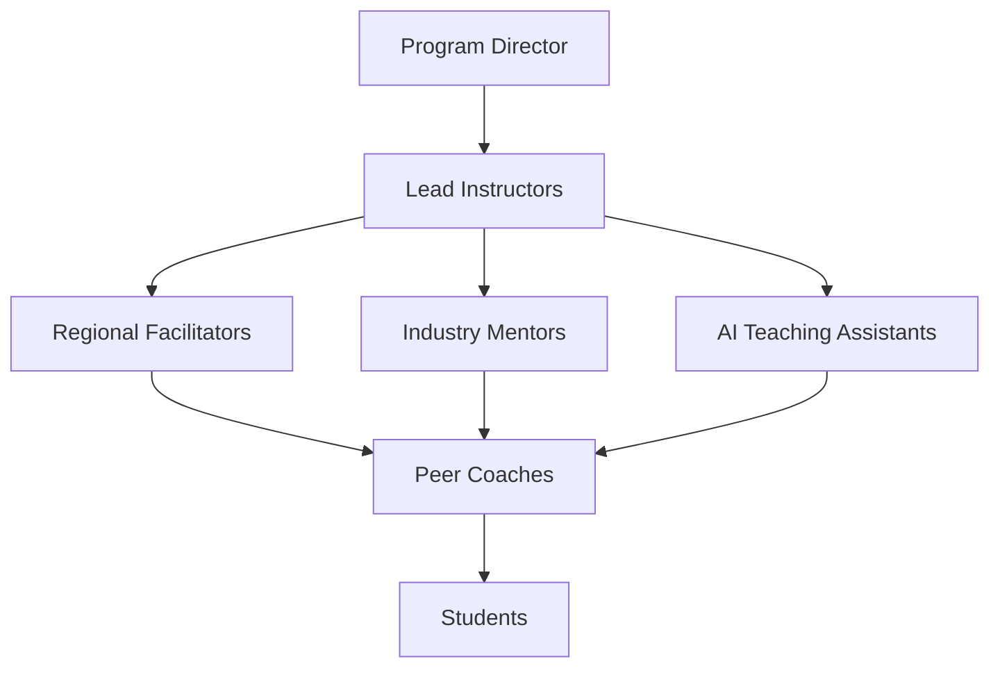

# Global Faculty Model for Online Delivery

## Overview

The Global Faculty Model creates a distributed, collaborative teaching structure that provides 24/7 support across time zones while maintaining program coherence and quality. This model leverages diverse expertise and perspectives to enrich the learning experience.

## Faculty Structure

### Hierarchical Teaching Team



### Role Definitions and Responsibilities

| Role | Count | Time Commitment | Primary Responsibilities |
|------|--------|-----------------|------------------------|
| **Program Director** | 1 | Full-time | Vision, coherence, quality assurance |
| **Lead Instructors** | 8 (1 per course) | 20 hrs/week | Course design, content creation, assessment |
| **Regional Facilitators** | 12 (4 time zones × 3) | 10 hrs/week | Sync sessions, regional support, cultural adaptation |
| **Industry Mentors** | 20 | 2-5 hrs/week | Real-world guidance, networking, guest sessions |
| **AI Teaching Assistants** | Unlimited | 24/7 | Immediate support, grading, content recommendation |
| **Peer Coaches** | 30 (alumni) | 3 hrs/week | Near-peer support, success strategies, motivation |

## Lead Instructor Model

### Responsibilities

```python
class LeadInstructor:
    def __init__(self, course_id):
        self.course = course_id
        self.weekly_tasks = {
            'monday': 'Review week ahead, post announcements',
            'tuesday': 'Host optional live session (Time Zone 1)',
            'wednesday': 'Create supplementary content',
            'thursday': 'Host optional live session (Time Zone 2)',
            'friday': 'Grade complex assessments, provide feedback',
            'weekend': 'Prepare next week, review analytics'
        }
    
    def core_responsibilities(self):
        return {
            'content_creation': 'Develop and update course materials',
            'assessment_design': 'Create authentic assessments',
            'quality_assurance': 'Ensure coherence and standards',
            'innovation': 'Integrate latest developments',
            'mentorship': 'Guide teaching team',
            'research': 'Publish on pedagogy and outcomes'
        }
    
    def success_metrics(self):
        return {
            'student_satisfaction': '>4.2/5',
            'completion_rate': '>80%',
            'assessment_quality': 'External validation',
            'content_freshness': 'Quarterly updates',
            'team_satisfaction': '>4.0/5'
        }
```

### Compensation Structure

```yaml
lead_instructor_compensation:
  base:
    preparation: "$15,000 per course development"
    delivery: "$10,000 per 8-week session"
    maintenance: "$2,000 quarterly updates"
  
  performance_bonuses:
    satisfaction_bonus: "$2,000 if >4.5/5 rating"
    completion_bonus: "$2,000 if >85% completion"
    innovation_bonus: "$1,000 for new pedagogical approach"
  
  benefits:
    professional_development: "$2,000 annual budget"
    conference_attendance: "Covered expenses"
    publication_support: "Co-authorship opportunities"
```

## Regional Facilitator Network

### Geographic Distribution

```javascript
const regionalFacilitators = {
    'Americas': {
        zones: ['EST', 'CST', 'PST'],
        facilitators: 3,
        languages: ['English', 'Spanish', 'Portuguese'],
        peak_hours: '6 PM - 10 PM local'
    },
    'Europe_Africa': {
        zones: ['GMT', 'CET', 'EAT'],
        facilitators: 3,
        languages: ['English', 'French', 'Arabic'],
        peak_hours: '7 PM - 11 PM local'
    },
    'Asia_Pacific': {
        zones: ['IST', 'SGT', 'JST', 'AEDT'],
        facilitators: 4,
        languages: ['English', 'Mandarin', 'Hindi'],
        peak_hours: '8 PM - 12 AM local'
    }
};
```

### Facilitator Responsibilities

```markdown
## Weekly Regional Facilitator Schedule

### Synchronous Activities (40%)
- **2 Office Hours**: 1-hour sessions in regional prime time
- **1 Workshop**: Topic-specific deep dive (recorded)
- **Pod Check-ins**: Monthly 15-minute pod visits

### Asynchronous Activities (60%)
- **Forum Moderation**: Daily presence, <24hr response
- **Content Localization**: Cultural examples and cases
- **Peer Review**: Grading and feedback on assignments
- **Student Support**: Individual coaching as needed
```

### Selection Criteria

```python
def evaluate_facilitator_candidate(candidate):
    requirements = {
        'education': 'Masters in relevant field',
        'experience': '3+ years online teaching',
        'timezone_coverage': 'Available during regional peak hours',
        'language': 'Fluent in English + regional language',
        'technical_skills': 'Comfortable with all platforms',
        'cultural_competence': 'Deep understanding of regional context'
    }
    
    preferred = {
        'industry_experience': 'AI/Tech sector background',
        'research': 'Published work in field',
        'community': 'Active in professional networks',
        'innovation': 'Experience with new pedagogies'
    }
    
    return assess_fit(candidate, requirements, preferred)
```

## Industry Mentor Program

### Mentor Profiles

```yaml
mentor_categories:
  technical_leaders:
    count: 5
    expertise: "AI/ML implementation"
    companies: "FAANG, startups, consultancies"
    commitment: "2 hours/week"
  
  business_executives:
    count: 5
    expertise: "AI strategy and transformation"
    companies: "Fortune 500, consulting firms"
    commitment: "2 hours/week"
  
  entrepreneurs:
    count: 5
    expertise: "AI ventures and innovation"
    companies: "Founders, VCs, accelerators"
    commitment: "3 hours/week"
  
  domain_experts:
    count: 5
    expertise: "Healthcare, Finance, Sustainability"
    companies: "Industry leaders"
    commitment: "2 hours/week"
```

### Mentor Engagement Model

```javascript
class MentorEngagement {
    constructor(mentor) {
        this.mentor = mentor;
        this.activities = {
            'guest_lectures': {
                frequency: 'Monthly',
                format: 'Pre-recorded or live',
                duration: '45 minutes',
                topics: 'Current industry challenges'
            },
            'office_hours': {
                frequency: 'Bi-weekly',
                format: 'Small group video calls',
                duration: '30 minutes',
                capacity: '5-8 students'
            },
            'project_feedback': {
                frequency: 'End of course',
                format: 'Written or video',
                scope: '3-5 projects reviewed'
            },
            'career_guidance': {
                frequency: 'On-demand',
                format: 'LinkedIn connections',
                scope: 'Informal networking'
            }
        };
    }
    
    matchStudents(students) {
        // AI-powered matching based on interests and goals
        return this.optimizeMatches(students, this.mentor.expertise);
    }
}
```

### Mentor Benefits

```markdown
## Industry Mentor Value Proposition

### Direct Benefits
- Access to emerging talent pipeline
- Visibility in academic community
- Thought leadership platform
- CPD credits (where applicable)

### Indirect Benefits
- Early access to research
- Network expansion
- Brand association with innovation
- Recruitment opportunities

### Recognition
- Annual mentor awards
- Speaking opportunities
- Co-authorship invitations
- Advisory board positions
```

## AI Teaching Assistant Architecture

### AI TA Capabilities

```python
class AITeachingAssistant:
    def __init__(self):
        self.capabilities = {
            'immediate_response': {
                'concept_clarification': self.explain_concepts,
                'debugging_help': self.debug_code,
                'resource_recommendation': self.suggest_resources,
                'deadline_reminders': self.track_deadlines
            },
            'automated_grading': {
                'quiz_grading': 'Instant with explanations',
                'code_assessment': 'Style, functionality, efficiency',
                'participation_tracking': 'Forum and activity metrics',
                'plagiarism_detection': 'Real-time checking'
            },
            'personalized_support': {
                'learning_path': self.adaptive_recommendations,
                'struggle_detection': self.identify_at_risk,
                'encouragement': self.motivational_messages,
                'progress_tracking': self.visualize_progress
            },
            'administrative': {
                'enrollment_support': self.handle_registration,
                'technical_issues': self.troubleshoot_platforms,
                'scheduling': self.coordinate_meetings,
                'documentation': self.generate_reports
            }
        }
    
    def escalation_protocol(self, issue):
        if self.can_resolve(issue):
            return self.resolve_immediately(issue)
        elif self.is_academic(issue):
            return self.escalate_to_facilitator(issue)
        elif self.is_technical(issue):
            return self.escalate_to_support(issue)
        else:
            return self.escalate_to_instructor(issue)
```

### AI TA Training and Monitoring

```yaml
ai_ta_management:
  training:
    initial:
      - Course content ingestion
      - Pedagogy alignment
      - Tone and style calibration
      - Edge case handling
    
    continuous:
      - Weekly feedback incorporation
      - Error pattern analysis
      - Response quality improvement
      - New content integration
  
  monitoring:
    metrics:
      - Response accuracy: ">95%"
      - Student satisfaction: ">4.0/5"
      - Escalation rate: "<10%"
      - Response time: "<30 seconds"
    
    quality_assurance:
      - Random response audits
      - Student feedback reviews
      - Instructor oversight
      - Continuous improvement loops
```

## Peer Coach Program

### Alumni as Peer Coaches

```javascript
const peerCoachProgram = {
    selection: {
        criteria: [
            'Completed program with >85% grade',
            'Strong communication skills',
            'Commitment to 2 semesters',
            'Available 3 hours/week'
        ],
        benefits: [
            'Certificate of coaching',
            'LinkedIn recommendation',
            'Networking opportunities',
            'Modest stipend ($500/course)'
        ]
    },
    
    responsibilities: {
        'study_groups': 'Facilitate weekly sessions',
        'peer_support': 'Answer questions in dedicated channel',
        'success_strategies': 'Share what worked for them',
        'motivation': 'Check in on struggling students',
        'culture_building': 'Organize social events'
    },
    
    training: {
        duration: '1 week intensive',
        topics: [
            'Active listening',
            'Inclusive facilitation',
            'Conflict resolution',
            'Platform mastery'
        ]
    }
};
```

## Collaboration Infrastructure

### Communication Channels

```markdown
## Faculty Communication Matrix

### Synchronous Channels
| Channel | Participants | Frequency | Purpose |
|---------|--------------|-----------|---------|
| All-hands | All faculty | Monthly | Alignment, updates |
| Course teams | Instructor + facilitators | Weekly | Coordination |
| Mentor briefing | Mentors + Director | Quarterly | Industry insights |
| Emergency | On-call team | As needed | Critical issues |

### Asynchronous Channels
| Platform | Purpose | Response Time |
|----------|---------|---------------|
| Slack - #faculty-general | Announcements, discussions | 48 hours |
| Slack - #course-specific | Course coordination | 24 hours |
| GitHub - faculty-resources | Shared materials | Continuous |
| Notion - faculty-wiki | Documentation | Continuous |
| Email - formal | Official communications | 72 hours |
```

### Knowledge Management

```python
class FacultyKnowledgeBase:
    def __init__(self):
        self.repositories = {
            'teaching_resources': {
                'lecture_recordings': 'Reusable video library',
                'slide_templates': 'Branded, accessible designs',
                'assessment_bank': 'Validated questions and rubrics',
                'case_studies': 'Industry-specific examples'
            },
            'best_practices': {
                'pedagogy_guides': 'Evidence-based methods',
                'platform_tutorials': 'Step-by-step guides',
                'troubleshooting': 'Common issues and solutions',
                'innovation_showcase': 'Successful experiments'
            },
            'professional_development': {
                'workshop_recordings': 'Faculty training sessions',
                'conference_materials': 'Shared learnings',
                'research_papers': 'Collaborative publications',
                'certification_paths': 'Professional growth'
            }
        }
    
    def contribution_tracking(self):
        # Track and reward knowledge sharing
        return self.gamify_contributions()
```

## Quality Assurance

### Teaching Quality Framework

```yaml
quality_metrics:
  student_feedback:
    weight: 30%
    collection: "Weekly pulse, end-of-course survey"
    threshold: ">4.0/5"
  
  peer_review:
    weight: 20%
    process: "Quarterly teaching observations"
    criteria: "Rubric-based assessment"
  
  content_quality:
    weight: 20%
    review: "External subject matter experts"
    frequency: "Annual"
  
  learning_outcomes:
    weight: 20%
    measurement: "Pre/post assessments"
    target: ">70% improvement"
  
  innovation:
    weight: 10%
    indicators: "New methods, tools, content"
    recognition: "Innovation awards"
```

### Continuous Improvement Process

```javascript
function facultyDevelopmentCycle() {
    const phases = {
        assessment: {
            timing: 'End of each course',
            methods: ['Student feedback', 'Self-reflection', 'Peer input'],
            output: 'Individual development plan'
        },
        training: {
            timing: 'Between courses',
            options: ['Workshops', 'Conferences', 'Certifications'],
            support: 'Funded by program'
        },
        experimentation: {
            timing: 'During course',
            scope: 'One new method per course',
            evaluation: 'A/B testing with control'
        },
        sharing: {
            timing: 'Monthly faculty meetings',
            format: ['Presentations', 'Write-ups', 'Discussions'],
            recognition: 'Best practice awards'
        }
    };
    
    return iterateContinuously(phases);
}
```

## Compensation and Incentives

### Comprehensive Compensation Model

```python
def calculate_faculty_compensation(role, performance):
    base_rates = {
        'program_director': 150000,  # Annual
        'lead_instructor': 25000,    # Per course
        'regional_facilitator': 10000, # Per course
        'industry_mentor': 5000,      # Per course
        'peer_coach': 500             # Per course
    }
    
    performance_multiplier = {
        'exceptional': 1.25,
        'exceeds': 1.15,
        'meets': 1.0,
        'developing': 0.9
    }
    
    incentives = {
        'publication': 2000,
        'innovation': 1000,
        'retention': 1500,
        'satisfaction': 2000
    }
    
    total = (base_rates[role] * 
             performance_multiplier[performance] +
             sum(earned_incentives))
    
    return total
```

### Non-Monetary Benefits

```markdown
## Faculty Benefits Package

### Professional Development
- Annual conference attendance (funded)
- Certification programs (covered)
- Research collaboration opportunities
- Publication support

### Career Advancement
- Teaching portfolio development
- Industry network access
- Leadership development programs
- Sabbatical opportunities

### Recognition
- Teaching excellence awards
- Innovation recognition
- Student choice awards
- Alumni hall of fame

### Flexibility
- Remote work
- Flexible scheduling
- Course selection preference
- Creative freedom
```

## Scalability Model

### Growth Planning

```yaml
scaling_strategy:
  phase_1:
    students: 100
    faculty: "1:10 ratio"
    focus: "Quality establishment"
  
  phase_2:
    students: 500
    faculty: "1:15 ratio"
    focus: "Process optimization"
  
  phase_3:
    students: 2000
    faculty: "1:20 ratio"
    focus: "Automation and AI"
  
  phase_4:
    students: 10000+
    faculty: "1:25 ratio"
    focus: "Self-organizing systems"
```

### Faculty Pipeline Development

```javascript
const facultyPipeline = {
    identification: {
        sources: [
            'Top student graduates',
            'Industry professionals',
            'Academic partners',
            'Professional networks'
        ],
        assessment: 'Teaching demos, interviews, references'
    },
    
    onboarding: {
        duration: '2 weeks intensive',
        components: [
            'Program philosophy',
            'Platform training',
            'Teaching methodology',
            'Shadow teaching'
        ]
    },
    
    progression: {
        'peer_coach': { next: 'regional_facilitator', time: '2 semesters' },
        'regional_facilitator': { next: 'lead_instructor', time: '4 semesters' },
        'industry_mentor': { next: 'lead_instructor', time: '3 semesters' }
    },
    
    retention: {
        strategies: [
            'Clear career paths',
            'Competitive compensation',
            'Continuous development',
            'Community building'
        ]
    }
};
```

## Success Metrics

### Faculty Performance Dashboard

```python
class FacultyMetrics:
    def __init__(self):
        self.kpis = {
            'teaching_effectiveness': {
                'student_satisfaction': {'target': 4.2, 'weight': 0.3},
                'learning_outcomes': {'target': 0.75, 'weight': 0.3},
                'completion_rates': {'target': 0.80, 'weight': 0.2},
                'engagement_metrics': {'target': 0.85, 'weight': 0.2}
            },
            'innovation': {
                'new_methods_tried': {'target': 2, 'weight': 0.4},
                'content_updates': {'target': 4, 'weight': 0.3},
                'research_output': {'target': 1, 'weight': 0.3}
            },
            'collaboration': {
                'peer_support': {'target': 0.9, 'weight': 0.3},
                'knowledge_sharing': {'target': 5, 'weight': 0.3},
                'team_participation': {'target': 0.95, 'weight': 0.4}
            }
        }
```

## Conclusion

The Global Faculty Model creates a resilient, scalable, and high-quality teaching infrastructure that leverages diverse expertise while maintaining program coherence. Through careful role definition, robust support systems, and continuous improvement processes, this model enables excellent education delivery across any scale and geography.