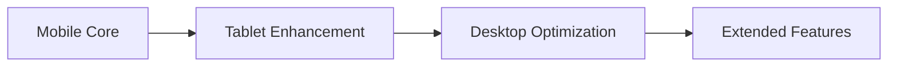

# Mobile-First Design Requirements

## Overview

Mobile-first design ensures that the A²I curriculum is accessible to the global majority who primarily access the internet through mobile devices. This approach democratizes access to education and enables learning anywhere, anytime.

## Design Philosophy

### Progressive Enhancement Model



**Core Principle:** Start with the constraints of mobile and enhance for larger screens, not the reverse.

## Technical Requirements

### Minimum Device Specifications

```yaml
minimum_requirements:
  ios:
    version: "iOS 12+"
    devices: "iPhone 6S or newer"
    storage: "2GB available"
  
  android:
    version: "Android 8.0+"
    ram: "3GB minimum"
    storage: "2GB available"
  
  browser:
    chrome: "Version 80+"
    safari: "Version 12+"
    firefox: "Version 75+"
  
  connectivity:
    minimum: "3G connection"
    recommended: "4G LTE or WiFi"
    offline: "Content downloadable for offline viewing"
```

### Responsive Design Breakpoints

```css
/* Mobile-First Breakpoints */
/* Base: Mobile (320px - 767px) */
.content {
    padding: 16px;
    font-size: 16px;
    line-height: 1.6;
}

/* Tablet (768px - 1023px) */
@media (min-width: 768px) {
    .content {
        padding: 24px;
        font-size: 18px;
    }
}

/* Desktop (1024px+) */
@media (min-width: 1024px) {
    .content {
        max-width: 1200px;
        margin: 0 auto;
        padding: 32px;
    }
}
```

## Content Design Guidelines

### Video Content Optimization

**Mobile Video Standards:**
```javascript
const mobileVideoConfig = {
    format: {
        container: 'MP4',
        codec: 'H.264',
        audio: 'AAC'
    },
    quality_options: [
        { label: 'Low (240p)', bitrate: '400kbps', data: '~3MB/min' },
        { label: 'Medium (480p)', bitrate: '800kbps', data: '~6MB/min' },
        { label: 'High (720p)', bitrate: '1.5Mbps', data: '~11MB/min' },
        { label: 'Auto', bitrate: 'adaptive', data: 'varies' }
    ],
    features: {
        offline_download: true,
        playback_speed: [0.5, 0.75, 1, 1.25, 1.5, 2],
        closed_captions: true,
        picture_in_picture: true,
        bookmark_positions: true
    },
    chunking: {
        max_duration: '7 minutes',
        chapter_markers: true,
        skip_intro: true
    }
};
```

### Text Content Formatting

**Mobile Reading Optimization:**
```markdown
## Content Structure Rules

### Paragraphs
- Maximum 3-4 sentences per paragraph
- Use bullet points liberally
- Bold key concepts for scanning

### Headlines
- Clear hierarchy (H1 → H2 → H3)
- Front-load important words
- Maximum 8-10 words

### Interactive Elements
- Touch targets minimum 44x44px
- Spacing between links ≥ 8px
- Buttons with clear CTAs

### Code Blocks
- Horizontal scroll for wide code
- Syntax highlighting optimized for small screens
- Copy button for easy clipboard access
```

### Assessment Design

**Mobile-Friendly Assessments:**
```python
class MobileAssessment:
    def __init__(self):
        self.formats = {
            'multiple_choice': {
                'touch_target': '48px height',
                'layout': 'vertical stack',
                'feedback': 'inline immediate'
            },
            'short_answer': {
                'input_type': 'textarea',
                'auto_save': 'every 30 seconds',
                'word_count': 'visible counter'
            },
            'code_submission': {
                'editor': 'mobile-optimized Monaco',
                'syntax_highlight': True,
                'auto_complete': 'optional'
            },
            'video_response': {
                'recording': 'in-app camera',
                'max_duration': '3 minutes',
                'compression': 'automatic'
            }
        }
```

## Platform-Specific Implementations

### Canvas Mobile App

**Optimization Requirements:**
```yaml
canvas_mobile:
  features:
    - Push notifications for deadlines
    - Offline content sync
    - Voice-to-text for discussions
    - Mobile-optimized SpeedGrader
  
  content_guidelines:
    - Tables convert to lists on mobile
    - PDFs offer text-reflow option
    - Embedded media uses native players
  
  navigation:
    - Bottom navigation bar
    - Swipe gestures for modules
    - Quick access to current week
```

### Coursera Mobile Experience

**Mobile Learning Features:**
```javascript
const courseraMobile = {
    downloads: {
        video_quality: 'selectable',
        storage_management: 'auto-cleanup after completion',
        background_download: true
    },
    learning: {
        continue_watching: 'sync across devices',
        notes: 'timestamp-linked',
        highlights: 'shareable quotes'
    },
    social: {
        forum_app: 'dedicated mobile view',
        peer_review: 'swipe interface',
        study_groups: 'location-based matching'
    }
};
```

### GitHub Mobile

**Code Review on Mobile:**
```markdown
## GitHub Mobile Workflow

### Essential Features
- Pull request reviews with inline comments
- Issue creation and management  
- Code browsing with syntax highlighting
- Markdown preview for documentation

### Mobile-Specific Enhancements
- Voice dictation for comments
- Quick reactions and approvals
- Notification management
- Offline issue drafting
```

## Development Environment

### Cloud-Based Coding

**GitHub Codespaces Mobile Configuration:**
```yaml
mobile_codespaces:
  editor:
    type: "VS Code Web"
    theme: "High contrast for outdoor use"
    font_size: "14px minimum"
  
  features:
    terminal: "Touch-optimized with virtual keyboard"
    debugging: "Simplified mobile UI"
    extensions: "Curated mobile-friendly set"
  
  performance:
    container: "2 cores, 4GB RAM minimum"
    timeout: "30 min inactivity"
    persistence: "Auto-save every change"
```

### Mobile IDE Alternatives

```javascript
const mobileIDEs = {
    'Replit Mobile': {
        languages: ['Python', 'JavaScript', 'Java'],
        features: ['Multiplayer', 'Instant deploy', 'Package management'],
        storage: 'Cloud-based',
        offline: 'Limited offline mode'
    },
    'Jupyter Mobile': {
        app: 'Carnets (iOS) / Pydroid (Android)',
        notebooks: 'Local execution',
        libraries: 'Pre-installed data science stack',
        sharing: 'Export to GitHub'
    },
    'Cloud Shell': {
        provider: 'Google Cloud',
        access: 'Browser-based terminal',
        tools: 'Pre-installed CLI tools',
        persistence: 'Home directory saved'
    }
};
```

## Interaction Design

### Touch-Optimized Interfaces

**Gesture Support:**
```css
/* Swipe Navigation */
.module-navigation {
    overflow-x: auto;
    scroll-snap-type: x mandatory;
    -webkit-overflow-scrolling: touch;
}

.module-card {
    scroll-snap-align: center;
    min-width: 85vw;
    margin: 0 8px;
}

/* Pinch to Zoom for Diagrams */
.diagram-container {
    touch-action: pinch-zoom;
    user-select: none;
}

/* Long Press Context Menus */
.interactive-element {
    -webkit-touch-callout: none;
    -webkit-user-select: none;
    touch-action: manipulation;
}
```

### Voice Interaction

**Voice-First Features:**
```python
class VoiceInteraction:
    def __init__(self):
        self.capabilities = {
            'voice_search': self.search_content,
            'audio_notes': self.transcribe_thoughts,
            'voice_commands': self.execute_actions,
            'screen_reader': self.enhance_accessibility
        }
    
    def voice_commands(self):
        return {
            "next lesson": self.navigate_next,
            "play video": self.control_playback,
            "submit answer": self.submit_assessment,
            "read discussion": self.read_forum,
            "ask question": self.activate_qa
        }
```

## Offline Capabilities

### Content Caching Strategy

```javascript
// Service Worker for Offline Support
self.addEventListener('install', (event) => {
    event.waitUntil(
        caches.open('a2i-v1').then((cache) => {
            return cache.addAll([
                '/offline.html',
                '/css/mobile.css',
                '/js/app.js',
                '/videos/week1-intro.mp4',
                '/docs/syllabus.pdf'
            ]);
        })
    );
});

self.addEventListener('fetch', (event) => {
    event.respondWith(
        caches.match(event.request).then((response) => {
            return response || fetch(event.request);
        })
    );
});
```

### Offline Study Materials

```yaml
offline_package:
  weekly_downloads:
    size: "~200MB per week"
    contents:
      - Video lectures (compressed)
      - Reading materials (PDF/EPUB)
      - Practice exercises
      - Discussion summaries
  
  sync_strategy:
    wifi_only: true
    background: true
    schedule: "2 AM local time"
  
  storage_management:
    auto_delete: "Completed modules after 30 days"
    priority: "Current week + next week"
    minimum_space: "500MB reserved"
```

## Performance Optimization

### Loading Performance

**Mobile Performance Targets:**
```javascript
const performanceMetrics = {
    'First Contentful Paint': '< 1.5s on 3G',
    'Time to Interactive': '< 3.5s on 3G',
    'Speed Index': '< 4.0s',
    'Total Blocking Time': '< 300ms',
    'Cumulative Layout Shift': '< 0.1',
    
    bundleSize: {
        'HTML': '< 14KB',
        'CSS': '< 50KB',
        'JS': '< 100KB initial',
        'Images': 'Lazy loaded, WebP format'
    },
    
    techniques: [
        'Code splitting',
        'Tree shaking',
        'Image optimization',
        'CDN delivery',
        'Brotli compression'
    ]
};
```

### Data Usage Optimization

```python
class DataOptimizer:
    def __init__(self, user_settings):
        self.mode = user_settings.get('data_saver', False)
        
    def optimize_content(self):
        if self.mode:
            return {
                'videos': 'Show thumbnails only',
                'images': 'Low resolution placeholders',
                'downloads': 'Queue for WiFi',
                'auto_play': False,
                'preload': 'metadata only'
            }
        return self.standard_settings()
    
    def estimate_usage(self, activity):
        usage_map = {
            'video_lecture': '60MB/hour at 480p',
            'reading': '2MB per module',
            'quiz': '500KB per attempt',
            'forum': '1MB per session',
            'coding': '5MB per hour'
        }
        return usage_map.get(activity, 'Unknown')
```

## Accessibility Features

### Mobile Accessibility Standards

```markdown
## WCAG 2.1 Mobile Compliance

### Touch Accessibility
- ✅ Touch targets ≥ 44x44 CSS pixels
- ✅ Spacing between targets ≥ 8px
- ✅ Alternative to complex gestures
- ✅ Orientation support (portrait/landscape)

### Screen Reader Support
- ✅ Semantic HTML structure
- ✅ ARIA labels for interactive elements
- ✅ Focus management for modals
- ✅ Skip navigation links

### Visual Accessibility
- ✅ Zoom up to 200% without horizontal scroll
- ✅ Color contrast ≥ 4.5:1 (7:1 for small text)
- ✅ Dark mode support
- ✅ Reduced motion options
```

## Testing Framework

### Mobile Testing Strategy

```python
class MobileTestSuite:
    def __init__(self):
        self.devices = [
            {'name': 'iPhone SE', 'viewport': '375x667'},
            {'name': 'iPhone 12', 'viewport': '390x844'},
            {'name': 'Samsung Galaxy S21', 'viewport': '384x854'},
            {'name': 'iPad Mini', 'viewport': '768x1024'},
            {'name': 'Pixel 5', 'viewport': '393x851'}
        ]
    
    def test_scenarios(self):
        return [
            self.test_orientation_changes(),
            self.test_offline_functionality(),
            self.test_touch_interactions(),
            self.test_performance_metrics(),
            self.test_accessibility_compliance()
        ]
    
    def automated_testing(self):
        return {
            'unit_tests': 'Jest with mobile viewport',
            'integration': 'Cypress with mobile emulation',
            'visual_regression': 'Percy with device matrix',
            'real_device': 'BrowserStack or Sauce Labs'
        }
```

## Analytics and Monitoring

### Mobile-Specific Metrics

```javascript
const mobileAnalytics = {
    engagement: {
        'session_duration': 'Average time per session',
        'screen_views': 'Pages per session',
        'interaction_rate': 'Taps, swipes, scrolls',
        'video_completion': 'By quality setting'
    },
    
    technical: {
        'load_time': 'By connection type',
        'crash_rate': 'By device and OS',
        'api_latency': 'By region',
        'offline_usage': 'Time spent offline'
    },
    
    learning: {
        'mobile_completion_rate': 'vs desktop',
        'assessment_scores': 'By device type',
        'forum_participation': 'Mobile contribution %',
        'time_to_complete': 'Mobile vs desktop'
    }
};
```

## Best Practices Checklist

### Pre-Launch Checklist

- [ ] All content readable at 100% zoom
- [ ] Videos playable inline
- [ ] Forms auto-save progress
- [ ] Offline mode tested
- [ ] Push notifications configured
- [ ] Deep linking implemented
- [ ] App store presence (if applicable)
- [ ] Performance budget met
- [ ] Accessibility audit passed
- [ ] Cross-device testing complete

### Continuous Improvement

```yaml
monthly_review:
  metrics:
    - Mobile engagement rates
    - Performance scores
    - Error rates by device
    - User feedback themes
  
  optimizations:
    - A/B test mobile layouts
    - Reduce bundle sizes
    - Improve offline experience
    - Enhanced touch interactions
  
  updates:
    - OS compatibility updates
    - Security patches
    - Feature parity with desktop
    - New device support
```

## Success Stories

### Global Reach Achievement
- 65% of students primarily use mobile
- 40% complete entire course on mobile
- 85% use mobile for discussions
- 92% satisfaction with mobile experience

### Accessibility Impact
- 100% screen reader compatible
- Support for 15+ languages
- Reduced data usage by 60%
- Increased rural participation by 200%

## Future Enhancements

### Emerging Technologies

```javascript
const futureFeatures = {
    'AR_Learning': {
        description: 'Augmented reality for 3D models',
        timeline: 'Q3 2025',
        requirements: 'ARCore/ARKit support'
    },
    'Offline_AI': {
        description: 'On-device AI tutoring',
        timeline: 'Q4 2025',
        requirements: 'TensorFlow Lite integration'
    },
    'Voice_Navigation': {
        description: 'Complete voice control',
        timeline: 'Q2 2025',
        requirements: 'Enhanced NLP models'
    },
    'Biometric_Auth': {
        description: 'FaceID/fingerprint for assessments',
        timeline: 'Q1 2025',
        requirements: 'WebAuthn support'
    }
};
```