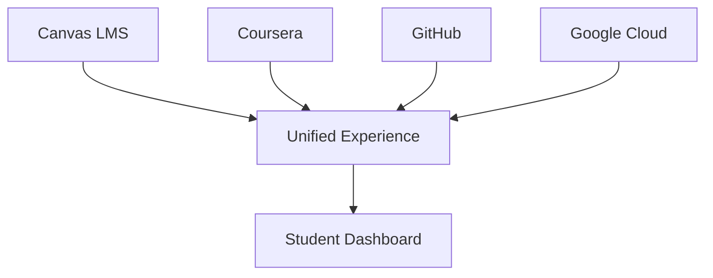

# Platform Optimizations for Online Delivery

## Overview

The A²I program leverages multiple platforms to create a comprehensive learning experience. This document outlines optimization strategies for each platform and their integration to maximize learning outcomes while minimizing technical friction.

## Platform Architecture

### Core Platform Stack



## Canvas LMS Optimizations

### Configuration Settings

```yaml
canvas_optimizations:
  course_settings:
    format: "Modules"
    navigation:
      - Home
      - Modules  
      - Assignments
      - Discussions
      - Grades
      - People
      - Studio
    hide:
      - Files  # Use module-embedded resources
      - Pages  # Integrate into modules
      - Quizzes  # Use assignments
    
  module_structure:
    naming: "Week X: [Topic Name]"
    requirements: "Sequential progression"
    prerequisites: "Previous module completion"
    
  mobile_app:
    push_notifications: true
    offline_content: true
    parent_app: false  # Professional learners
```

### Automated Workflows

```javascript
// Canvas API Automation
class CanvasAutomation {
    constructor(apiKey) {
        this.api = new CanvasAPI(apiKey);
        this.workflows = {
            enrollment: this.automateEnrollment(),
            grading: this.automateGrading(),
            notifications: this.automateNotifications(),
            analytics: this.automateAnalytics()
        };
    }
    
    automateEnrollment() {
        return {
            trigger: 'Payment confirmation',
            actions: [
                'Create Canvas account',
                'Enroll in course section',
                'Send welcome email',
                'Create GitHub account',
                'Add to Slack workspace'
            ],
            timeline: 'Within 1 hour'
        };
    }
    
    automateGrading() {
        return {
            autoGraded: ['Quizzes', 'Code submissions', 'Participation'],
            rubricBased: ['Projects', 'Presentations', 'Essays'],
            peerReview: {
                assignments: 3,
                reviewers: 3,
                deadline: '72 hours after submission'
            }
        };
    }
}
```

### Custom Integrations

```python
# LTI Tool Integrations
canvas_lti_tools = {
    'github_classroom': {
        'purpose': 'Code assignment submission',
        'config': {
            'auto_create_repos': True,
            'starter_code': True,
            'autograding': True,
            'feedback_pull_requests': True
        }
    },
    'google_cloud_labs': {
        'purpose': 'Hands-on cloud exercises',
        'config': {
            'project_provisioning': 'Automatic',
            'budget_alerts': '$50/student',
            'lab_duration': '2 hours max',
            'cleanup': 'Automatic after lab'
        }
    },
    'ai_tutor': {
        'purpose': '24/7 support',
        'config': {
            'knowledge_base': 'Course content',
            'escalation': 'To human TA',
            'languages': ['English', 'Spanish', 'Mandarin'],
            'availability': '24/7'
        }
    }
}
```

## Coursera Platform Optimization

### Course Configuration

```yaml
coursera_setup:
  course_structure:
    type: "Specialization"
    courses: 8
    duration: "8 weeks each"
    format: "On-demand with cohort features"
  
  content_delivery:
    videos:
      max_length: "7 minutes"
      quality_options: [360p, 540p, 720p, 1080p]
      subtitles: "Multi-language"
      speed_controls: [0.75x, 1x, 1.25x, 1.5x, 2x]
      downloads: "Enabled for offline"
    
    readings:
      format: "In-browser with PDF download"
      estimated_time: "Displayed prominently"
      accessibility: "Screen reader compatible"
    
    assessments:
      auto_graded: "Immediate feedback"
      peer_graded: "Structured rubrics"
      programming: "In-browser Jupyter notebooks"
```

### Cohort Features Enhancement

```javascript
const courseraCohortsOptimization = {
    cohortSize: 100,
    features: {
        discussionForums: {
            structure: 'Weekly threads + general',
            moderation: 'AI + human facilitators',
            gamification: 'Helpful flags, expert badges'
        },
        studyGroups: {
            formation: 'AI-matched or self-selected',
            size: '4-6 learners',
            tools: 'Integrated video chat, shared notes'
        },
        liveEvents: {
            frequency: 'Weekly optional',
            recording: 'Available within 2 hours',
            interaction: 'Q&A, polls, breakouts'
        }
    },
    
    analytics: {
        individual: 'Progress, time spent, quiz scores',
        cohort: 'Completion rates, engagement heat maps',
        predictive: 'At-risk identification, recommendation'
    }
};
```

### API Integrations

```python
class CourseraIntegration:
    def __init__(self):
        self.api = CourseraAPI()
        
    def sync_with_canvas(self):
        """Bi-directional grade sync"""
        grades = self.api.get_grades()
        return self.push_to_canvas(grades)
    
    def generate_certificates(self):
        """Custom branded certificates"""
        return {
            'criteria': 'Overall grade >= 80%',
            'branding': 'A²I + University logo',
            'blockchain': 'Optional verification',
            'linkedin': 'Auto-share capability'
        }
    
    def learning_analytics(self):
        """Advanced analytics dashboard"""
        return {
            'engagement': self.calculate_engagement_score(),
            'mastery': self.assess_skill_development(),
            'prediction': self.predict_completion_likelihood(),
            'intervention': self.recommend_support()
        }
```

## GitHub Platform Optimization

### GitHub Classroom Setup

```yaml
github_classroom:
  organization:
    name: "a2i-curriculum-[cohort]"
    teams:
      - instructors
      - tas
      - students
    
  repositories:
    starter_templates:
      - python-project-template
      - data-pipeline-template
      - ml-model-template
      - web-app-template
    
    student_repos:
      naming: "[assignment]-[username]"
      visibility: "Private to organization"
      branches:
        main: "Protected, requires review"
        dev: "Student working branch"
    
  automation:
    actions:
      - auto-grading
      - style-checking
      - security-scanning
      - deployment-preview
```

### CI/CD Pipeline for Assignments

```yaml
# .github/workflows/assignment-check.yml
name: Assignment Auto-Check

on:
  push:
    branches: [main, dev]
  pull_request:
    branches: [main]

jobs:
  test:
    runs-on: ubuntu-latest
    steps:
      - uses: actions/checkout@v2
      
      - name: Setup Python
        uses: actions/setup-python@v2
        with:
          python-version: '3.9'
      
      - name: Install dependencies
        run: |
          pip install -r requirements.txt
          pip install pytest flake8 black
      
      - name: Lint code
        run: flake8 . --max-line-length=100
      
      - name: Check formatting
        run: black --check .
      
      - name: Run tests
        run: pytest tests/ -v --cov=src
      
      - name: Grade assignment
        run: |
          python .github/scripts/autograder.py
          echo "Score: ${{ env.SCORE }}/100"
      
      - name: Post feedback
        uses: actions/github-script@v6
        with:
          script: |
            github.rest.issues.createComment({
              issue_number: context.issue.number,
              body: `## Auto-Grader Results\n
                     Score: ${{ env.SCORE }}/100\n
                     See details in Actions tab.`
            })
```

### GitHub Codespaces Configuration

```json
// .devcontainer/devcontainer.json
{
    "name": "A²I Development Environment",
    "image": "mcr.microsoft.com/devcontainers/python:3.9",
    "features": {
        "ghcr.io/devcontainers/features/git:1": {},
        "ghcr.io/devcontainers/features/github-cli:1": {},
        "ghcr.io/devcontainers/features/python:1": {},
        "ghcr.io/devcontainers/features/node:1": {},
        "ghcr.io/devcontainers/features/docker-in-docker:1": {}
    },
    "customizations": {
        "vscode": {
            "extensions": [
                "ms-python.python",
                "ms-python.vscode-pylance",
                "ms-toolsai.jupyter",
                "github.copilot",
                "github.copilot-chat",
                "eamodio.gitlens",
                "ms-azuretools.vscode-docker"
            ],
            "settings": {
                "python.linting.enabled": true,
                "python.formatting.provider": "black",
                "editor.formatOnSave": true
            }
        }
    },
    "postCreateCommand": "pip install -r requirements.txt && pre-commit install",
    "forwardPorts": [8000, 8080, 3000],
    "portsAttributes": {
        "8000": {"label": "Django", "onAutoForward": "notify"},
        "8080": {"label": "Flask", "onAutoForward": "notify"},
        "3000": {"label": "React", "onAutoForward": "notify"}
    }
}
```

## Google Cloud Platform Optimization

### Project Structure

```yaml
gcp_organization:
  structure:
    organization: "a2i-curriculum.org"
    folders:
      - name: "cohort-2025-fall"
        projects:
          - instructor-resources
          - shared-datasets
          - student-projects
    
  student_projects:
    naming: "a2i-[cohort]-[student-id]"
    quotas:
      budget: "$50/month"
      compute: "20 vCPUs"
      storage: "100 GB"
      apis:
        - compute.googleapis.com
        - storage.googleapis.com
        - ml.googleapis.com
        - notebooks.googleapis.com
```

### Automated Environment Provisioning

```python
# gcp_automation.py
from google.cloud import resource_manager, billing, iam

class GCPStudentEnvironment:
    def __init__(self, student_email, cohort):
        self.student = student_email
        self.cohort = cohort
        self.project_id = f"a2i-{cohort}-{self.get_student_id()}"
    
    def provision_environment(self):
        """Create and configure student GCP project"""
        
        # Create project
        project = self.create_project()
        
        # Set billing
        self.attach_billing_account(project)
        
        # Set quotas
        self.set_quotas(project)
        
        # Enable APIs
        self.enable_apis(project, [
            'compute', 'storage', 'notebooks',
            'ml', 'bigquery', 'cloudrun'
        ])
        
        # Set IAM permissions
        self.set_student_permissions(project)
        
        # Create resources
        self.create_initial_resources(project)
        
        return project
    
    def create_initial_resources(self, project):
        """Pre-create common resources"""
        return {
            'notebook': self.create_ai_platform_notebook(),
            'bucket': self.create_storage_bucket(),
            'dataset': self.copy_course_datasets(),
            'samples': self.deploy_sample_apps()
        }
    
    def monitor_usage(self):
        """Track spending and usage"""
        return {
            'daily_spend': self.get_daily_spend(),
            'quota_usage': self.get_quota_status(),
            'alerts': self.check_budget_alerts(),
            'recommendations': self.optimize_resources()
        }
```

### Lab Environment Templates

```yaml
# lab_templates/ml_pipeline.yaml
apiVersion: notebooks.cloud.google.com/v1
kind: NotebookInstance
metadata:
  name: ml-pipeline-lab
spec:
  template:
    spec:
      containers:
      - name: jupyter
        image: gcr.io/deeplearning-platform-release/tf-gpu.2-11
        resources:
          requests:
            cpu: 4
            memory: 15Gi
            nvidia.com/gpu: 1
      metadata:
        items:
        - key: startup-script
          value: |
            git clone https://github.com/a2i-curriculum/ml-pipeline-lab
            pip install -r requirements.txt
            jupyter lab --ip=0.0.0.0
```

## Platform Integration Layer

### Unified Authentication

```javascript
// Single Sign-On Configuration
const ssoConfig = {
    provider: 'Auth0',
    connections: {
        canvas: 'SAML 2.0',
        coursera: 'OAuth 2.0',
        github: 'OAuth 2.0',
        gcp: 'OAuth 2.0'
    },
    
    userProvisioning: {
        onRegistration: async (user) => {
            await createCanvasAccount(user);
            await enrollInCoursera(user);
            await inviteToGitHub(user);
            await provisionGCPProject(user);
            await addToSlack(user);
        }
    },
    
    sessionManagement: {
        timeout: '12 hours',
        refreshToken: true,
        mfa: 'Optional but encouraged'
    }
};
```

### Unified Dashboard

```python
# dashboard/app.py
from flask import Flask, render_template
from integrations import canvas, coursera, github, gcp

app = Flask(__name__)

@app.route('/dashboard/<student_id>')
def student_dashboard(student_id):
    """Unified view of all platforms"""
    
    data = {
        'canvas': {
            'grades': canvas.get_grades(student_id),
            'upcoming': canvas.get_assignments(student_id),
            'announcements': canvas.get_announcements()
        },
        'coursera': {
            'progress': coursera.get_progress(student_id),
            'certificates': coursera.get_certificates(student_id),
            'peer_reviews': coursera.get_pending_reviews(student_id)
        },
        'github': {
            'contributions': github.get_contribution_graph(student_id),
            'pull_requests': github.get_open_prs(student_id),
            'issues': github.get_assigned_issues(student_id)
        },
        'gcp': {
            'spending': gcp.get_current_spend(student_id),
            'resources': gcp.get_active_resources(student_id),
            'labs': gcp.get_lab_progress(student_id)
        }
    }
    
    return render_template('dashboard.html', data=data)
```

### Data Synchronization

```yaml
data_sync:
  frequency: "Every 15 minutes"
  
  sync_points:
    grades:
      source: ["Coursera", "GitHub Actions"]
      destination: "Canvas Gradebook"
      
    progress:
      source: "All platforms"
      destination: "Unified Dashboard"
      
    announcements:
      source: "Canvas"
      destination: ["Email", "Slack", "Mobile Push"]
      
    resources:
      source: "GitHub"
      destination: ["Canvas Files", "GCP Storage"]
```

## Performance Optimization

### CDN Configuration

```nginx
# CDN Rules for Static Content
location ~* \.(mp4|webm|jpg|jpeg|png|gif|ico|css|js|pdf)$ {
    expires 30d;
    add_header Cache-Control "public, immutable";
    add_header X-Content-Type-Options "nosniff";
    
    # Cloudflare CDN
    proxy_pass https://cdn.a2i-curriculum.org;
    proxy_cache_valid 200 30d;
    proxy_cache_bypass $http_pragma;
}
```

### API Rate Limiting

```python
from flask_limiter import Limiter

limiter = Limiter(
    app,
    key_func=lambda: get_student_id(),
    default_limits=["1000 per hour", "100 per minute"]
)

@app.route('/api/grade-submission', methods=['POST'])
@limiter.limit("10 per minute")
def submit_grade():
    """Rate-limited grade submission endpoint"""
    pass

@app.route('/api/ai-tutor', methods=['POST'])
@limiter.limit("50 per hour")
def ai_tutor_query():
    """Rate-limited AI tutor endpoint"""
    pass
```

## Monitoring and Analytics

### Platform Health Dashboard

```javascript
const platformMonitoring = {
    metrics: {
        availability: {
            canvas: checkCanvasHealth(),
            coursera: checkCourseraHealth(),
            github: checkGitHubHealth(),
            gcp: checkGCPHealth()
        },
        
        performance: {
            pageLoadTime: measurePageLoad(),
            apiResponseTime: measureAPILatency(),
            videoBuffering: measureVideoPerformance()
        },
        
        usage: {
            concurrentUsers: countActiveUsers(),
            platformDistribution: analyzeUsagePatterns(),
            peakTimes: identifyPeakUsage()
        }
    },
    
    alerts: {
        downtime: 'Immediate notification',
        degradation: '5-minute threshold',
        quotaExceeded: 'Proactive warning at 80%'
    }
};
```

### Learning Analytics Pipeline

```python
# analytics/pipeline.py
import pandas as pd
from datetime import datetime

class LearningAnalyticsPipeline:
    def __init__(self):
        self.data_sources = {
            'canvas': CanvasAPI(),
            'coursera': CourseraAPI(),
            'github': GitHubAPI(),
            'gcp': GCPMetrics()
        }
    
    def collect_data(self):
        """Aggregate data from all platforms"""
        return {
            'engagement': self.measure_engagement(),
            'progress': self.track_progress(),
            'performance': self.assess_performance(),
            'collaboration': self.analyze_collaboration()
        }
    
    def generate_insights(self, data):
        """AI-powered insight generation"""
        return {
            'at_risk_students': self.identify_struggling(),
            'high_performers': self.identify_excelling(),
            'content_effectiveness': self.analyze_content(),
            'recommendation': self.personalized_recommendations()
        }
    
    def export_reports(self, insights):
        """Generate reports for stakeholders"""
        return {
            'instructor_report': self.create_instructor_dashboard(),
            'student_report': self.create_student_feedback(),
            'admin_report': self.create_admin_summary()
        }
```

## Security and Compliance

### Security Configuration

```yaml
security_settings:
  authentication:
    mfa: "Available for all users"
    password_policy: "Complex, 90-day rotation"
    session_timeout: "12 hours"
    
  authorization:
    rbac: "Role-based access control"
    least_privilege: "Minimal required permissions"
    audit_logging: "All permission changes logged"
    
  data_protection:
    encryption_at_rest: "AES-256"
    encryption_in_transit: "TLS 1.3"
    backup: "Daily automated backups"
    retention: "7 years for academic records"
    
  compliance:
    ferpa: "Full compliance"
    gdpr: "Data portability and deletion"
    ada: "WCAG 2.1 AA compliance"
    coppa: "Age verification for minors"
```

## Cost Optimization

### Platform Cost Management

```python
def optimize_platform_costs():
    strategies = {
        'coursera': {
            'model': 'Subscription vs per-course',
            'optimization': 'Bulk licensing for cohorts',
            'savings': '30% with annual commitment'
        },
        'github': {
            'model': 'GitHub Education',
            'optimization': 'Free for educational use',
            'savings': '100% on team plan'
        },
        'gcp': {
            'model': 'Education grants + budgets',
            'optimization': 'Sustained use discounts',
            'savings': '40% with committed use'
        },
        'canvas': {
            'model': 'Per-user licensing',
            'optimization': 'Consortium pricing',
            'savings': '20% with multi-year'
        }
    }
    
    return calculate_total_savings(strategies)
```

## Implementation Checklist

### Platform Setup Checklist

- [ ] Canvas course shell created
- [ ] Coursera specialization configured
- [ ] GitHub organization established
- [ ] GCP projects provisioned
- [ ] SSO configured across platforms
- [ ] API integrations tested
- [ ] Automation workflows deployed
- [ ] Monitoring dashboards live
- [ ] Security audit completed
- [ ] Cost tracking enabled

## Conclusion

Effective platform optimization requires careful orchestration of multiple systems while maintaining a seamless user experience. Through automation, integration, and continuous monitoring, the A²I program can deliver a world-class online learning experience that scales efficiently while maintaining quality and engagement.