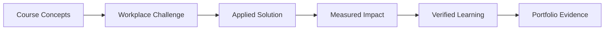

# Work-Integrated Learning Framework

## Overview

Work-Integrated Learning (WIL) transforms the online A²I program from theoretical education into immediate organizational impact. This framework enables working professionals to apply course concepts directly in their workplace, creating real value while learning.

## Core Philosophy

### Learning Through Application



**Key Principles:**
1. Every concept must have workplace application potential
2. Real problems drive deeper learning than hypothetical cases
3. Organizational impact validates educational outcomes
4. Manager verification ensures authenticity and value

## WIL Implementation Model

### Three-Track System

```yaml
wil_tracks:
  corporate_track:
    target: "Employees in established organizations"
    projects: "Internal transformation initiatives"
    verification: "Direct manager or sponsor"
    weight: "60% of students"
  
  entrepreneur_track:
    target: "Founders and freelancers"
    projects: "Startup or client applications"
    verification: "Client or advisor"
    weight: "25% of students"
  
  social_impact_track:
    target: "NGO, government, education sectors"
    projects: "Public benefit initiatives"
    verification: "Director or board member"
    weight: "15% of students"
```

## Project Identification Process

### Week 0-1: Problem Discovery

**Problem Identification Workshop:**
```markdown
## Workplace AI Opportunity Canvas

### Current State Analysis
1. **Pain Points:** What processes are inefficient?
2. **Data Assets:** What data do we have but don't use?
3. **Repetitive Tasks:** What could be automated?
4. **Decision Bottlenecks:** Where do delays occur?

### Opportunity Mapping
1. **Quick Wins:** <3 month implementation
2. **Strategic Initiatives:** 3-12 month horizon
3. **Transformational:** 12+ month vision

### Stakeholder Impact
1. **Internal:** Employees, departments
2. **External:** Customers, partners
3. **Financial:** Cost, revenue, efficiency

### Selection Criteria
- [ ] Clear problem definition
- [ ] Measurable success metrics
- [ ] Stakeholder support
- [ ] Data availability
- [ ] 8-week feasibility
```

### AI Opportunity Audit Tool

```python
class WorkplaceAIAudit:
    def __init__(self, organization):
        self.org = organization
        self.opportunities = []
        
    def assess_readiness(self):
        return {
            'data_maturity': self.evaluate_data_infrastructure(),
            'culture_readiness': self.assess_ai_acceptance(),
            'technical_capability': self.review_it_resources(),
            'business_alignment': self.check_strategic_fit()
        }
    
    def prioritize_projects(self):
        scoring_matrix = {
            'impact': 0.3,      # Business value
            'feasibility': 0.25, # Technical doability
            'urgency': 0.2,     # Time sensitivity
            'learning': 0.15,   # Educational value
            'visibility': 0.1    # Career benefit
        }
        return self.rank_opportunities(scoring_matrix)
    
    def generate_project_charter(self, selected_project):
        return {
            'problem_statement': self.define_problem(),
            'success_metrics': self.establish_kpis(),
            'stakeholders': self.identify_sponsors(),
            'timeline': self.create_8_week_plan(),
            'resources': self.list_requirements()
        }
```

## Integration with Course Modules

### Course-Specific Applications

| Course | Workplace Application Examples |
|--------|-------------------------------|
| **A²I 601** | AI strategy alignment with company OKRs, vendor selection for specific use case |
| **A²I 602** | Data pipeline improvement, cloud migration planning, data governance implementation |
| **A²I 603** | A/B testing framework setup, customer segmentation analysis, attribution modeling |
| **A²I 604** | Demand forecasting model, pricing optimization, resource allocation system |
| **A²I 605** | Workflow automation, chatbot implementation, document processing pipeline |
| **A²I 606** | AI governance framework, compliance documentation, risk assessment process |
| **A²I 607** | New AI product business case, pricing strategy, competitive analysis |
| **A²I 608** | Change management plan, AI literacy program, transformation roadmap |

### Weekly Application Cycle

```markdown
## Weekly WIL Rhythm

### Monday-Tuesday: Learn
- Course content consumption
- Concept understanding
- Tool exploration

### Wednesday-Thursday: Apply
- Map concepts to workplace
- Prototype solutions
- Test approaches

### Friday: Document
- Update project log
- Measure progress
- Capture learnings

### Weekend: Reflect & Share
- Pod discussion
- Peer feedback
- Iteration planning
```

## Stakeholder Engagement

### Manager/Sponsor Involvement

**Initial Engagement (Week 1):**
```markdown
## Manager Briefing Template

### Program Overview
- A²I program objectives
- 8-week commitment
- Expected outcomes

### Project Proposal
- Problem to be solved
- Potential impact
- Resource needs
- Success metrics

### Support Requested
- 20% time allocation (ideal)
- Access to data/systems
- Stakeholder introductions
- End-of-course verification

### Benefits to Organization
- Immediate problem solving
- Upskilled employee
- Potential ROI
- Innovation catalyst
```

**Progress Communication:**
```python
def weekly_manager_update(week_number, project_status):
    return {
        'summary': f"Week {week_number} Progress",
        'completed': list_completed_tasks(),
        'insights': share_key_learnings(),
        'blockers': identify_challenges(),
        'next_steps': outline_upcoming_work(),
        'support_needed': request_specific_help()
    }
```

### Stakeholder Presentation Template

```markdown
## Mid-Point Stakeholder Review (Week 4)

### Agenda (30 minutes)
1. Problem Restatement (5 min)
2. Progress to Date (10 min)
3. Initial Findings (10 min)
4. Next Steps (5 min)

### Deliverables
- Executive summary (1 page)
- Progress dashboard
- Risk mitigation plan
- Resource requests

### Outcomes
- Continued support confirmation
- Scope adjustments if needed
- Additional resources
- Success metric validation
```

## Verification Process

### Manager Verification Requirements

**Verification Letter Template:**
```markdown
## Workplace Application Verification

**Date:** [Date]
**Student:** [Name]
**Organization:** [Company]
**Department:** [Department]

### Project Overview
**Title:** [Project Title]
**Duration:** [Start Date - End Date]
**Problem Addressed:** [Brief description]

### Outcomes Achieved
1. **Quantitative Impact:**
   - [Metric 1]: [Before] → [After] ([% change])
   - [Metric 2]: [Before] → [After] ([% change])
   - [Metric 3]: [Before] → [After] ([% change])

2. **Qualitative Impact:**
   - [Stakeholder feedback]
   - [Process improvements]
   - [Cultural changes]

### Verification Statement
I verify that [Student Name] successfully applied concepts from the A²I program to address a real organizational challenge. The project delivered measurable value and demonstrated the following competencies:

- [ ] Strategic problem framing
- [ ] Data-driven decision making
- [ ] Stakeholder management
- [ ] Technical implementation
- [ ] Change leadership

**Supervisor Name:** [Name]
**Title:** [Title]
**Signature:** [Digital signature]
**Contact:** [Email/Phone]
```

### Alternative Verification Methods

For situations where direct manager verification isn't possible:

```yaml
alternative_verification:
  client_projects:
    verifier: "Client or customer"
    evidence: "Contract, testimonial, payment"
    
  startup_projects:
    verifier: "Advisor, investor, or co-founder"
    evidence: "Pitch deck, metrics dashboard"
    
  nonprofit_projects:
    verifier: "Board member or director"
    evidence: "Impact report, grant application"
    
  confidential_projects:
    verifier: "HR or Learning & Development"
    evidence: "Sanitized case study"
```

## Project Documentation

### WIL Portfolio Structure

```markdown
## Student WIL Portfolio

### 1. Project Charter
- Problem statement
- Stakeholder map
- Success metrics
- Timeline

### 2. Weekly Logs
- Activities completed
- Challenges faced
- Solutions applied
- Learnings captured

### 3. Technical Artifacts
- Code repositories
- Data analyses
- Model documentation
- Architecture diagrams

### 4. Business Artifacts
- Executive presentations
- Business cases
- ROI calculations
- Change plans

### 5. Impact Evidence
- Before/after metrics
- Stakeholder feedback
- Verification letter
- Future recommendations

### 6. Reflection Essay
- Learning journey
- Competency development
- Career impact
- Future applications
```

### GitHub Repository Template

```bash
workplace-project/
├── README.md              # Project overview
├── docs/
│   ├── charter.md        # Project charter
│   ├── stakeholders.md   # Stakeholder analysis
│   └── impact.md         # Impact assessment
├── weekly-logs/
│   ├── week1.md
│   ├── week2.md
│   └── ...
├── code/                 # If applicable
│   ├── src/
│   ├── tests/
│   └── notebooks/
├── presentations/
│   ├── midpoint.pdf
│   └── final.pdf
├── evidence/
│   ├── metrics/
│   ├── feedback/
│   └── verification.pdf
└── reflection/
    └── essay.md
```

## Assessment Integration

### WIL Assessment Rubric

| Criteria | Weight | Excellent (90-100%) | Good (70-89%) | Needs Improvement (<70%) |
|----------|--------|-------------------|---------------|-------------------------|
| **Problem Definition** | 15% | Clear, strategic, measurable | Well-defined, relevant | Vague or tactical only |
| **Solution Design** | 20% | Innovative, scalable, elegant | Functional, appropriate | Basic or incomplete |
| **Implementation** | 20% | Fully deployed, documented | Prototype tested | Concept only |
| **Impact Measurement** | 20% | Quantified ROI, verified | Metrics tracked | Anecdotal evidence |
| **Stakeholder Management** | 15% | Strong buy-in, championed | Adequate support | Limited engagement |
| **Documentation** | 10% | Comprehensive, reusable | Complete, clear | Minimal or unclear |

### Grading Formula

```python
def calculate_wil_grade(project):
    components = {
        'problem_definition': (project.charter_quality, 0.15),
        'solution_design': (project.architecture_score, 0.20),
        'implementation': (project.deployment_status, 0.20),
        'impact': (project.roi_measurement, 0.20),
        'stakeholder': (project.engagement_level, 0.15),
        'documentation': (project.portfolio_completeness, 0.10)
    }
    
    total = sum(score * weight for score, weight in components.values())
    
    # Bonus for exceptional impact
    if project.roi > 100000 or project.users_impacted > 1000:
        total = min(total * 1.1, 100)
    
    return total
```

## Common WIL Projects

### By Industry

**Technology Companies:**
- ML model deployment pipeline
- Data quality monitoring system
- Customer churn prediction
- Developer productivity tools
- A/B testing framework

**Financial Services:**
- Fraud detection enhancement
- Credit risk assessment
- Trading algorithm audit
- Compliance automation
- Customer service chatbot

**Healthcare:**
- Patient flow optimization
- Clinical decision support
- Revenue cycle improvement
- Staff scheduling system
- Quality metric dashboards

**Retail/E-commerce:**
- Recommendation engine
- Inventory optimization
- Price optimization
- Customer segmentation
- Return prediction

**Manufacturing:**
- Predictive maintenance
- Quality control automation
- Supply chain optimization
- Energy efficiency
- Safety monitoring

## Support Resources

### WIL Coaching

**Weekly Office Hours Topics:**
```markdown
Week 1: Project scoping and stakeholder alignment
Week 2: Data access and technical setup
Week 3: Quick wins and proof of concept
Week 4: Midpoint review preparation
Week 5: Scaling and implementation
Week 6: Impact measurement and ROI
Week 7: Documentation and knowledge transfer
Week 8: Final presentation and verification
```

### Peer Learning

**WIL Project Showcase:**
- Weekly "Demo Friday" sessions
- Industry-specific channels
- Best practice library
- Template sharing
- Peer mentorship

### Troubleshooting Common Issues

| Challenge | Solution |
|-----------|----------|
| No management support | Start with personal productivity project |
| Limited data access | Use public datasets for similar problem |
| Confidentiality concerns | Create sanitized case study |
| Technical blockers | Leverage cloud platforms and APIs |
| Time constraints | Focus on proof of concept |
| Measurement difficulties | Use proxy metrics and qualitative feedback |

## Long-term Impact

### Career Development

**WIL Portfolio as Career Asset:**
```yaml
career_benefits:
  immediate:
    - Demonstrated impact at current organization
    - Visibility with senior leadership
    - Potential promotion or new role
    
  job_search:
    - Concrete examples for interviews
    - Verified impact metrics
    - GitHub portfolio
    
  entrepreneurship:
    - Validated business ideas
    - Initial customer base
    - Proof of concept for investors
```

### Organizational Benefits

**ROI for Employers:**
```python
def calculate_employer_roi(employee_projects):
    benefits = {
        'direct_savings': sum(p.cost_savings for p in employee_projects),
        'revenue_impact': sum(p.revenue_increase for p in employee_projects),
        'productivity': sum(p.hours_saved * hourly_rate for p in employee_projects),
        'innovation_value': estimate_innovation_impact(employee_projects)
    }
    
    costs = {
        'tuition': tuition_reimbursement,
        'time': employee_hours * hourly_rate,
        'resources': infrastructure_costs
    }
    
    roi = (sum(benefits.values()) - sum(costs.values())) / sum(costs.values())
    return f"{roi * 100:.1f}% ROI"
```

### Program Evolution

**Continuous Improvement Through WIL:**
- Real-world validation of curriculum
- Industry trend identification
- Case study development
- Alumni mentor network
- Corporate partnership pipeline

## Success Stories

### Case 1: Supply Chain Transformation
```markdown
**Student:** Maria S., Supply Chain Manager
**Company:** Global Retailer
**Project:** Demand Forecasting Enhancement

**Problem:** 30% forecast error leading to $2M annual waste
**Solution:** ML ensemble model with external data
**Impact:** 
- Forecast error reduced to 18%
- $800K annual savings
- Promoted to Director of Analytics
```

### Case 2: Customer Service Revolution
```markdown
**Student:** James L., Customer Success Lead
**Company:** SaaS Startup
**Project:** Intelligent Ticket Routing

**Problem:** 48-hour average response time
**Solution:** NLP-based classification and routing
**Impact:**
- Response time reduced to 4 hours
- Customer satisfaction up 35%
- System adopted company-wide
```

### Case 3: Healthcare Efficiency
```markdown
**Student:** Dr. Sarah K., Medical Director
**Company:** Regional Hospital
**Project:** ED Wait Time Prediction

**Problem:** Patient dissatisfaction with uncertain waits
**Solution:** Real-time prediction model with patient app
**Impact:**
- Patient satisfaction up 40%
- Left-without-treatment rate down 25%
- Model shared with hospital network
```