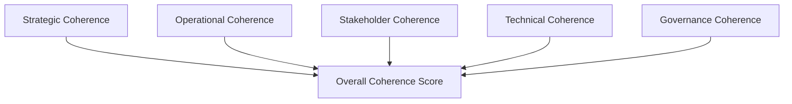
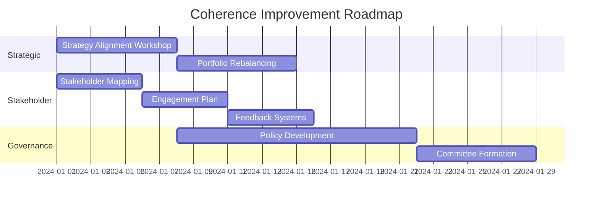

# A²I Coherence Scorecard Framework

## Overview

The Coherence Scorecard operationalizes the program's central insight—"capability is cheap; coherence is scarce"—into measurable business metrics. This framework provides students and organizations with a practical tool to assess and improve the coherence of their AI initiatives.

## Theoretical Foundation

### Defining Coherence in Business Context

**Coherence** is the alignment and integration of AI capabilities across five critical dimensions:



## The Five Dimensions of Coherence

### 1. Strategic Coherence (20%)

**Definition:** Alignment between AI initiatives and organizational strategy

**Key Metrics:**
```python
strategic_coherence_metrics = {
    'mission_alignment': {
        'weight': 0.25,
        'measure': 'AI initiatives mapped to mission statement',
        'scale': '0-100% of initiatives with clear mission link'
    },
    'strategic_coverage': {
        'weight': 0.25,
        'measure': 'Strategic objectives supported by AI',
        'scale': 'Percentage of strategic goals with AI enablement'
    },
    'portfolio_balance': {
        'weight': 0.25,
        'measure': 'Distribution across horizons',
        'scale': 'Ratio of quick wins : strategic : transformational'
    },
    'competitive_positioning': {
        'weight': 0.25,
        'measure': 'AI maturity vs. competitors',
        'scale': 'Leader / Fast Follower / Laggard'
    }
}
```

**Assessment Questions:**
- Do all AI initiatives clearly support strategic objectives?
- Is there a balanced portfolio across time horizons?
- Does AI investment align with competitive strategy?
- Are trade-offs explicitly acknowledged and managed?

### 2. Operational Coherence (20%)

**Definition:** Integration of AI into business processes and workflows

**Key Metrics:**
```yaml
operational_coherence:
  process_integration:
    metric: "Percentage of AI seamlessly embedded in workflows"
    target: ">80%"
    measurement: "User surveys + system logs"
  
  efficiency_gains:
    metric: "Process improvement from AI"
    target: ">25% efficiency gain"
    measurement: "Time studies + cost analysis"
  
  adoption_rate:
    metric: "Active usage of AI tools"
    target: ">75% daily active users"
    measurement: "Platform analytics"
  
  feedback_loops:
    metric: "Continuous improvement cycles"
    target: "Monthly iteration"
    measurement: "Update frequency + performance trends"
```

### 3. Stakeholder Coherence (20%)

**Definition:** Alignment across all affected parties

**Stakeholder Matrix:**
| Stakeholder | Engagement Level | Value Delivered | Satisfaction |
|------------|-----------------|----------------|--------------|
| Employees | Co-creation | Productivity tools | >4.0/5 |
| Customers | Informed | Enhanced experience | >4.2/5 |
| Partners | Collaborative | Shared insights | >4.0/5 |
| Regulators | Transparent | Compliance evidence | No violations |
| Investors | Strategic | ROI demonstration | Positive sentiment |

**Assessment Framework:**
```javascript
function assessStakeholderCoherence() {
    const dimensions = {
        awareness: "Do stakeholders understand AI initiatives?",
        alignment: "Do they support the direction?",
        engagement: "Are they actively participating?",
        value: "Are they receiving tangible benefits?",
        trust: "Do they trust the AI systems?"
    };
    
    return calculateWeightedScore(dimensions);
}
```

### 4. Technical Coherence (20%)

**Definition:** Consistency and integration of technical architecture

**Technical Coherence Indicators:**
```python
class TechnicalCoherence:
    def __init__(self):
        self.metrics = {
            'architecture_consistency': {
                'measure': 'Common platforms and standards',
                'indicator': 'Percentage using enterprise stack'
            },
            'data_interoperability': {
                'measure': 'Data sharing capability',
                'indicator': 'APIs and data contracts in place'
            },
            'model_governance': {
                'measure': 'MLOps maturity',
                'indicator': 'Model registry and monitoring coverage'
            },
            'technical_debt': {
                'measure': 'Maintenance burden',
                'indicator': 'Hours spent on integration vs. innovation'
            }
        }
    
    def calculate_score(self):
        return weighted_average(self.metrics)
```

### 5. Governance Coherence (20%)

**Definition:** Alignment of policies, controls, and accountability

**Governance Framework:**
```yaml
governance_coherence:
  policy_alignment:
    - AI ethics policy: "Documented and trained"
    - Data governance: "Roles and responsibilities clear"
    - Risk framework: "AI risks in enterprise risk register"
  
  control_effectiveness:
    - Access controls: "Role-based and audited"
    - Model validation: "Independent review process"
    - Compliance monitoring: "Automated checks"
  
  accountability_structure:
    - AI committee: "Cross-functional with exec sponsor"
    - Decision rights: "Clear RACI matrix"
    - Incident response: "Defined escalation path"
```

## Coherence Scorecard Template

### Executive Dashboard View

```markdown
# Q4 2024 AI Coherence Scorecard

## Overall Coherence Score: 72/100 🟡

### Dimension Scores
| Dimension | Score | Trend | Target |
|-----------|--------|-------|--------|
| Strategic | 78/100 | ↑ | 85 |
| Operational | 65/100 | → | 75 |
| Stakeholder | 71/100 | ↑ | 80 |
| Technical | 69/100 | ↑ | 75 |
| Governance | 77/100 | ↑ | 85 |

### Key Insights
✅ Strong strategic alignment with 90% of initiatives mapped to OKRs
⚠️ Operational adoption lagging - only 60% DAU on AI tools
🔴 Technical debt accumulating - 40% of time on integration

### Recommendations
1. Launch adoption campaign for operational teams
2. Consolidate to 3 primary AI platforms
3. Implement monthly stakeholder feedback loops
```

## Implementation Guide

### Phase 1: Baseline Assessment (Week 1-2)

**Data Collection:**
```python
def collect_baseline_data():
    data_sources = {
        'strategic': survey_executives(),
        'operational': analyze_process_metrics(),
        'stakeholder': conduct_360_feedback(),
        'technical': audit_architecture(),
        'governance': review_policies()
    }
    return synthesize_baseline(data_sources)
```

### Phase 2: Gap Analysis (Week 3-4)

**Gap Identification Matrix:**
| Dimension | Current | Target | Gap | Priority |
|-----------|---------|--------|-----|----------|
| Strategic | 45 | 80 | -35 | High |
| Operational | 60 | 75 | -15 | Medium |
| Stakeholder | 40 | 80 | -40 | High |
| Technical | 70 | 75 | -5 | Low |
| Governance | 50 | 85 | -35 | High |

### Phase 3: Improvement Planning (Week 5-6)

**Improvement Roadmap:**


### Phase 4: Implementation & Monitoring (Week 7-8)

**Monitoring Dashboard:**
```javascript
const coherenceDashboard = {
    updateFrequency: 'weekly',
    metrics: {
        leading: ['training completion', 'tool usage', 'meeting attendance'],
        lagging: ['project success rate', 'ROI', 'satisfaction scores']
    },
    alerts: {
        threshold: 0.7,
        escalation: 'email + dashboard notification'
    },
    reporting: {
        executive: 'monthly',
        operational: 'weekly',
        detailed: 'real-time'
    }
};
```

## Scoring Methodology

### Calculation Framework

```python
class CoherenceCalculator:
    def __init__(self):
        self.weights = {
            'strategic': 0.20,
            'operational': 0.20,
            'stakeholder': 0.20,
            'technical': 0.20,
            'governance': 0.20
        }
    
    def calculate_dimension_score(self, dimension, metrics):
        """
        Each dimension scored 0-100 based on weighted metrics
        """
        scores = []
        for metric, data in metrics.items():
            actual = data['actual']
            target = data['target']
            weight = data['weight']
            score = min((actual / target) * 100, 100) * weight
            scores.append(score)
        return sum(scores)
    
    def calculate_overall_coherence(self, dimension_scores):
        """
        Weighted average of dimension scores
        """
        total = 0
        for dimension, score in dimension_scores.items():
            total += score * self.weights[dimension]
        return total
    
    def generate_grade(self, score):
        """
        Letter grade and interpretation
        """
        if score >= 90:
            return 'A', 'Highly Coherent', 'green'
        elif score >= 75:
            return 'B', 'Coherent', 'yellow'
        elif score >= 60:
            return 'C', 'Partially Coherent', 'orange'
        else:
            return 'D', 'Incoherent', 'red'
```

### Maturity Levels

| Score | Level | Characteristics |
|-------|-------|----------------|
| 90-100 | Optimized | Self-improving, industry-leading |
| 75-89 | Managed | Measured, controlled, improving |
| 60-74 | Defined | Documented, somewhat consistent |
| 40-59 | Reactive | Ad-hoc, project-based |
| 0-39 | Initial | Chaotic, no coordination |

## Use Cases

### 1. Quarterly Business Reviews

**Executive Presentation Format:**
```markdown
## AI Coherence Update - Q4 2024

### Headlines
- Overall coherence improved 12 points to 72/100
- Strategic alignment reached target at 85/100
- Operational adoption remains challenge at 65/100

### Business Impact
- $2.3M cost savings from coherent operations
- 35% faster project delivery
- 92% stakeholder satisfaction

### Next Quarter Focus
1. Operational adoption campaign
2. Technical debt reduction
3. Advanced governance frameworks
```

### 2. Project Prioritization

**Project Scoring Matrix:**
| Project | Strategic | Operational | Stakeholder | Technical | Governance | Total | Rank |
|---------|-----------|-------------|-------------|-----------|------------|-------|------|
| Chatbot | 80 | 90 | 85 | 70 | 75 | 80 | 1 |
| ML Platform | 95 | 70 | 60 | 95 | 80 | 80 | 2 |
| Data Lake | 70 | 85 | 70 | 85 | 70 | 76 | 3 |

### 3. Vendor Evaluation

**Vendor Coherence Assessment:**
```python
def evaluate_vendor_coherence(vendor, our_scorecard):
    alignment = {
        'strategic_fit': compare_strategies(vendor, our_scorecard),
        'operational_integration': assess_workflow_fit(vendor),
        'stakeholder_acceptance': predict_adoption(vendor),
        'technical_compatibility': evaluate_architecture(vendor),
        'governance_alignment': review_compliance(vendor)
    }
    return calculate_vendor_coherence_score(alignment)
```

## Industry Benchmarks

### Coherence by Industry (2024)

| Industry | Average Score | Top Quartile | Leader |
|----------|--------------|--------------|---------|
| Technology | 75 | 85 | 92 |
| Financial Services | 68 | 78 | 88 |
| Healthcare | 62 | 72 | 85 |
| Retail | 65 | 75 | 87 |
| Manufacturing | 58 | 68 | 82 |

## Tools and Resources

### Assessment Tools
- Coherence survey templates
- Interview guides
- Metric collection scripts
- Dashboard templates

### Improvement Resources
- Best practice library
- Workshop facilitation guides
- Change management templates
- Communication plans

### Technology Enablers
- Analytics platforms
- Survey tools
- Dashboard software
- Collaboration platforms

## Continuous Evolution

### Feedback Incorporation
```yaml
feedback_cycles:
  monthly:
    - User feedback sessions
    - Metric accuracy review
    - Weight adjustments
  
  quarterly:
    - Dimension relevance assessment
    - Benchmark updates
    - Framework enhancements
  
  annually:
    - Complete framework review
    - Industry validation
    - Academic research integration
```

### Research Integration
- Annual review of coherence literature
- Case study development
- Cross-industry validation
- Academic partnerships

## Conclusion

The Coherence Scorecard transforms the abstract concept of organizational coherence into actionable metrics and improvement plans. By regularly assessing and improving coherence across all five dimensions, organizations can maximize the value of their AI investments while the A²I program provides students with a powerful framework for driving real organizational change.