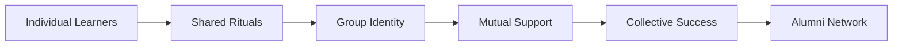

# Digital Cohort Rituals for Online Learning

## Overview

Digital cohort rituals create the social fabric that transforms isolated online learners into a vibrant, connected community. These carefully designed recurring activities build relationships, maintain engagement, and foster the peer learning essential to the A²I program's success.

## Theoretical Foundation

### The Science of Digital Community



**Key Principles:**
1. **Regularity** - Predictable patterns create anticipation
2. **Participation** - Active involvement builds ownership
3. **Recognition** - Celebration reinforces positive behaviors
4. **Evolution** - Rituals adapt based on cohort personality
5. **Memory** - Documented moments create shared history

## Weekly Ritual Architecture

### The Weekly Learning Rhythm

```javascript
const weeklyRituals = {
    monday: {
        name: "Monday Momentum",
        time: "Async - released 6 AM all timezones",
        format: "AI-generated weekly briefing + instructor video",
        duration: "5 minutes consumption",
        purpose: "Set intentions, preview content, motivate",
        participation: "Required - auto-tracked"
    },
    
    tuesday: {
        name: "Teaching Tuesday",
        time: "Three 30-min sessions across timezones",
        format: "Optional live deep-dive",
        purpose: "Complex topic exploration",
        participation: "Optional - recorded"
    },
    
    wednesday: {
        name: "Wisdom Wednesday",
        time: "Async forum",
        format: "Peer teaching - students explain concepts",
        purpose: "Learning through teaching",
        participation: "Rotating requirement"
    },
    
    thursday: {
        name: "Throwback Thursday",
        time: "Async social",
        format: "Share learning moments, failures, successes",
        purpose: "Build vulnerability and trust",
        participation: "Encouraged"
    },
    
    friday: {
        name: "Feature Friday",
        time: "Async showcase",
        format: "Demo work in progress",
        purpose: "Celebrate progress, get feedback",
        participation: "Optional but celebrated"
    },
    
    weekend: {
        name: "Weekend Wind-down",
        time: "Sunday evening local time",
        format: "Optional social hour",
        purpose: "Informal connection",
        participation: "Self-organized by pods"
    }
};
```

### Monday Momentum Ritual

**AI-Generated Weekly Briefing Template:**
```markdown
# Week 5 Monday Momentum 🚀

## 🎯 This Week's Focus: Intelligent Agents

Hello [Student Name]!

### 📊 Your Progress
- Last week: 92% completion, great job on the data pipeline project!
- This week: 4 assignments, 1 peer review, 1 live session

### 🌟 Cohort Highlights
- Maria's fraud detection model saved her company $50K
- James received peer choice award for helpful forum posts
- Pod "Data Dynamos" completed all assignments early

### 💡 Week 5 Learning Goals
1. Design your first intelligent agent
2. Implement human-in-the-loop controls
3. Evaluate agent performance metrics

### 🎥 Instructor Message
[Embedded 90-second video from Lead Instructor]

### 🔥 Challenge of the Week
First person to implement a working chatbot wins special recognition!

### 💬 Question to Ponder
"If your AI agent could have one superpower, what would it be and why?"
Share your thoughts in #monday-momentum

**You've got this! See you in the forums.**
*- Your A²I Teaching Team*
```

## Monthly Ritual Cycles

### Month-Long Engagement Arcs

```python
class MonthlyRituals:
    def __init__(self, cohort):
        self.cohort = cohort
        self.monthly_events = {
            'week1': self.industry_speaker_series(),
            'week2': self.peer_teaching_festival(),
            'week3': self.hackathon_mini(),
            'week4': self.celebration_showcase()
        }
    
    def industry_speaker_series(self):
        return {
            'event': 'Industry Leader Fireside Chat',
            'format': 'Live with Q&A, recorded',
            'duration': '60 minutes',
            'speaker': self.rotate_industry_mentors(),
            'topics': 'Current challenges, career advice, trends',
            'interaction': 'Submit questions in advance, live Q&A',
            'followup': 'Speaker available in forum for 48 hours'
        }
    
    def peer_teaching_festival(self):
        return {
            'event': 'Teach-Back Tuesday Extended',
            'format': 'Student-led workshops',
            'duration': '30-min slots throughout day',
            'topics': self.crowd_source_topics(),
            'recognition': 'Best Teacher award',
            'recording': 'All sessions recorded for library'
        }
    
    def hackathon_mini(self):
        return {
            'event': '24-Hour Innovation Sprint',
            'format': 'Async with sync kickoff',
            'challenge': self.generate_real_world_problem(),
            'teams': 'Self-organized or random',
            'prizes': 'LinkedIn recognition, mentor meetings',
            'showcase': 'Following Monday Momentum'
        }
    
    def celebration_showcase(self):
        return {
            'event': 'Monthly Milestone Celebration',
            'format': 'Gallery walk + social hour',
            'components': [
                'Project exhibitions',
                'Peer recognition awards',
                'Instructor shoutouts',
                'Birthday/life celebrations',
                'Next month preview'
            ]
        }
```

### Cultural Celebrations

```yaml
inclusive_celebrations:
  global_holidays:
    strategy: "Acknowledge major holidays across cultures"
    implementation:
      - Holiday calendar in syllabus
      - Optional cultural sharing
      - Flexible deadlines around holidays
  
  cohort_specific:
    examples:
      - Diwali coding celebration (India-heavy cohort)
      - Lunar New Year virtual party (Asia cohort)
      - Thanksgiving gratitude circle (Americas)
      - Eid reflection and sharing (MENA region)
  
  secular_milestones:
    universal:
      - Course halfway point
      - First successful project
      - 100% pod attendance week
      - Cohort helping milestone
```

## Onboarding Rituals

### Week 0: Pre-Course Community Building

```markdown
## Cohort Onboarding Journey

### Day -7: Welcome Package
**Digital Package Contents:**
- Personalized welcome video from instructor
- Cohort roster with fun facts
- Pre-course checklist
- Slack/Discord invitation
- Virtual background package
- Playlist: "Songs that inspire us"

### Day -5: Speed Networking
**Format:** 3-minute paired conversations
**Platform:** Automated matching via Airmeet
**Prompts:**
1. "What brought you to AI?"
2. "Biggest hope for this program?"
3. "Hidden superpower?"
**Output:** Connection map visualization

### Day -3: Technical Orientation
**Async Checkpoints:**
- [ ] Platform access verified
- [ ] Development environment setup
- [ ] First GitHub commit
- [ ] Introduction video posted
- [ ] Pod assignment received

### Day -1: Virtual Kick-off Party
**Agenda:**
- Instructor welcome (10 min)
- Pod reveals and breakouts (20 min)
- Cohort name voting (10 min)
- Virtual toast and commitments (10 min)
- Q&A and excitement building (20 min)
```

### Creating Cohort Identity

```javascript
class CohortIdentity {
    constructor() {
        this.elements = {
            name: this.voteCohortName(),
            motto: this.crowdsourceMotto(),
            mascot: this.designMascot(),
            colors: this.selectColors(),
            playlist: this.collaborativePlaylist(),
            hashtag: this.uniqueHashtag()
        };
    }
    
    voteCohortName() {
        const suggestions = [
            'Neural Navigators',
            'Coherence Catalysts',
            'Intelligence Orchestrators',
            'Future Architects',
            'Custom suggestions...'
        ];
        return this.democraticVote(suggestions);
    }
    
    createArtifacts() {
        return {
            badge: this.digitalBadgeDesign(),
            banner: this.zoomBackground(),
            certificate: this.customTemplate(),
            website: this.cohortLandingPage()
        };
    }
}
```

## Engagement Rituals

### Asynchronous Engagement Boosters

**Daily Micro-Rituals:**
```python
daily_rituals = {
    'morning_checkin': {
        'format': 'Emoji status in Slack',
        'prompt': 'How are you feeling today? 😊😴🤔💪',
        'purpose': 'Ambient awareness',
        'time': '30 seconds'
    },
    'win_of_the_day': {
        'format': 'One-line share',
        'channel': '#daily-wins',
        'purpose': 'Celebrate small victories',
        'recognition': 'Weekly compilation'
    },
    'help_request': {
        'format': 'Structured ask',
        'template': 'Stuck on [X], tried [Y], need [Z]',
        'response': 'Peer or AI within 2 hours',
        'karma': 'Points for helping'
    },
    'gratitude_gesture': {
        'format': 'Thank a peer',
        'channel': '#gratitude',
        'frequency': 'Encouraged daily',
        'impact': 'Gratitude leaderboard'
    }
}
```

### Synchronous Connection Points

```yaml
live_rituals:
  coffee_chats:
    frequency: Weekly optional
    format: 15-min random pairs
    platform: Donut app integration
    topics: Provided or freestyle
    outcome: New connections
  
  study_halls:
    frequency: Daily, multiple timezones
    format: Quiet co-working
    platform: Always-on Zoom room
    features:
      - Cameras optional
      - Pomodoro timer
      - Background music
      - Break-out rooms
  
  pod_pow_wows:
    frequency: Weekly required
    format: Pod-specific
    duration: 60-90 minutes
    activities:
      - Check-ins
      - Peer learning
      - Problem solving
      - Social time
```

## Recognition Rituals

### Peer Recognition System

```javascript
const recognitionFramework = {
    categories: {
        'Helper Extraordinaire': 'Most helpful in forums',
        'Innovation Star': 'Creative problem solving',
        'Community Builder': 'Bringing people together',
        'Perseverance Award': 'Overcoming challenges',
        'Teaching Excellence': 'Best peer explanations',
        'Pod MVP': 'Voted by pod members',
        'Global Connector': 'Cross-cultural bridge building'
    },
    
    nomination_process: {
        frequency: 'Weekly',
        method: 'Peer nominations via form',
        voting: 'Anonymous cohort vote',
        announcement: 'Monday Momentum'
    },
    
    rewards: {
        digital_badge: 'LinkedIn shareable',
        feature_story: 'Cohort newsletter',
        mentor_meeting: '1:1 with industry mentor',
        course_discount: '10% off next course',
        speaker_opportunity: 'Present to next cohort'
    },
    
    visualization: {
        leaderboard: 'Gamified but inclusive',
        badge_wall: 'Profile decorations',
        story_wall: 'Featured successes',
        impact_meter: 'Collective achievements'
    }
};
```

### Instructor Recognition

```markdown
## Instructor Shout-out Protocol

### Weekly Highlights
- Exceptional assignment: Featured with permission
- Forum contribution: Screenshot and praise
- Breakthrough moment: Story in newsletter
- Pod achievement: Whole pod recognition

### Personalized Feedback
- Video messages for exceptional work
- Handwritten note simulation
- LinkedIn recommendations
- Reference letters offered

### Public Celebration
- Social media features
- Case study development
- Conference co-presentation
- Alumni hall of fame
```

## Transition Rituals

### End-of-Course Ceremonies

```python
class GraduationRitual:
    def __init__(self, cohort):
        self.cohort = cohort
        
    def final_week_sequence(self):
        return {
            'Monday': self.final_presentations(),
            'Tuesday': self.peer_awards_ceremony(),
            'Wednesday': self.instructor_reflections(),
            'Thursday': self.future_commitments(),
            'Friday': self.celebration_party()
        }
    
    def final_presentations(self):
        return {
            'format': 'Async video gallery',
            'duration': '3-5 minutes per student',
            'content': 'Project + journey + gratitude',
            'platform': 'Custom showcase site',
            'sharing': 'Public with permission'
        }
    
    def peer_awards_ceremony(self):
        return {
            'format': 'Live event with recording',
            'awards': self.generate_custom_awards(),
            'speeches': 'Student representatives',
            'surprises': 'Instructor performances',
            'memorabilia': 'Digital yearbook'
        }
    
    def celebration_party(self):
        return {
            'format': 'Multi-timezone parties',
            'activities': [
                'Virtual toast',
                'Breakout room reunions',
                'Trivia about cohort',
                'Dance party',
                'Future plans sharing'
            ],
            'artifacts': 'Recorded for memories'
        }
```

### Alumni Onboarding

```yaml
alumni_transition:
  immediate:
    - Certificate delivery
    - Alumni network invitation
    - Peer coach opportunity
    - Success story request
  
  30_days:
    - Impact survey
    - Testimonial request
    - Referral program
    - Advanced course options
  
  ongoing:
    - Monthly newsletter
    - Annual reunion
    - Mentorship opportunities
    - Research participation
```

## Virtual Space Design

### Platform-Specific Rituals

```javascript
const platformRituals = {
    slack_discord: {
        channels: {
            '#general': 'Announcements and broad discussion',
            '#random': 'Non-academic sharing',
            '#help': 'Quick questions and answers',
            '#celebrations': 'Wins and milestones',
            '#pods': 'Pod-specific channels',
            '#industry': 'Career and industry discussion'
        },
        bots: {
            'Welcome Bot': 'Onboards new members',
            'Birthday Bot': 'Celebrates birthdays',
            'Standup Bot': 'Daily check-ins',
            'Praise Bot': 'Peer recognition'
        },
        customs: {
            'Emoji reactions': 'Encouraged for engagement',
            'Thread use': 'Keep conversations organized',
            'GIF Friday': 'Express yourself with GIFs',
            '@here sparingly': 'Respect attention'
        }
    },
    
    canvas_coursera: {
        discussions: {
            'Introduction Circle': 'Week 1 mandatory',
            'Reflection Corner': 'Weekly thoughts',
            'Project Gallery': 'Share work',
            'Study Groups': 'Self-organized'
        },
        announcements: {
            frequency: 'Monday, Wednesday, Friday',
            tone: 'Encouraging and informative',
            multimedia: 'Include videos/images'
        }
    }
};
```

### Virtual Environment Design

```css
/* Cohort Virtual Space Aesthetic */
.cohort-space {
    /* Visual Identity */
    --primary-color: #voted-by-cohort;
    --secondary-color: #complementary;
    --accent-color: #energizing;
    
    /* Spatial Metaphors */
    .main-hall { /* Central gathering space */ }
    .quiet-rooms { /* Focused study areas */ }
    .social-lounge { /* Informal connections */ }
    .showcase-gallery { /* Work exhibition */ }
    .help-desk { /* Support center */ }
    
    /* Ambient Elements */
    .background-music { /* Optional soundscapes */ }
    .virtual-plants { /* Growing with progress */ }
    .weather-widget { /* Global awareness */ }
    .quote-rotator { /* Daily inspiration */ }
}
```

## Measurement and Iteration

### Ritual Effectiveness Metrics

```python
class RitualAnalytics:
    def __init__(self):
        self.metrics = {
            'participation_rate': self.track_attendance(),
            'engagement_quality': self.analyze_interactions(),
            'sentiment_analysis': self.measure_mood(),
            'retention_impact': self.correlate_with_completion(),
            'community_health': self.assess_connections()
        }
    
    def weekly_report(self):
        return {
            'top_rituals': self.rank_by_engagement(),
            'struggling_rituals': self.identify_low_participation(),
            'student_feedback': self.summarize_comments(),
            'recommendations': self.suggest_improvements()
        }
    
    def iterate_rituals(self):
        if self.participation < 0.5:
            return self.redesign_ritual()
        elif self.sentiment < 0.7:
            return self.adjust_format()
        else:
            return self.enhance_successful()
```

### Student Feedback Loops

```yaml
ritual_feedback:
  weekly_pulse:
    question: "Which rituals added value this week?"
    format: Quick emoji rating
    response_rate: ">70%"
  
  monthly_survey:
    topics:
      - Ritual effectiveness
      - Suggested improvements
      - New ritual ideas
      - Cultural considerations
  
  end_of_course:
    comprehensive_review:
      - Rank all rituals
      - Suggest keepers/changes
      - Share memorable moments
      - Advise next cohort
```

## Cultural Adaptation

### Global Sensitivity

```javascript
function adaptRitualsToculture(cohortDemographics) {
    const adaptations = {
        timing: adjustForRamadanDiwaliLunarNewYear(),
        language: provideMultilingualOptions(),
        formats: respectCulturalCommunicationStyles(),
        celebrations: includeRegionalTraditions(),
        food: virtualPotluckWithRecipes(),
        music: globalPlaylistCollaboration()
    };
    
    return personalizeWhileMaintainingCohesion(adaptations);
}
```

## Success Stories

### Ritual Impact Examples

```markdown
## Cohort Success Stories

### "The Global Innovators" (Spring 2024)
- Created 24-hour continuous coding relay
- 95% participation in weekly rituals
- 0% dropout rate
- Continued meeting monthly after graduation

### "Data Dreamers" (Fall 2024)
- Organized virtual field trips to tech companies
- Peer teaching festival had 100% participation
- Created 50+ tutorial videos for future cohorts
- 12 members started companies together

### "AI for Good" (Winter 2024)
- Weekly social impact showcases
- Partnered with 5 NGOs for projects
- Raised $10K for charity through hackathon
- Created lasting mentorship relationships
```

## Implementation Checklist

### Pre-Course Setup
- [ ] Ritual calendar created
- [ ] Platform spaces configured
- [ ] Automation tools setup
- [ ] Facilitator training complete
- [ ] Materials prepared

### Week 1 Launch
- [ ] Onboarding sequence activated
- [ ] First rituals executed
- [ ] Participation tracked
- [ ] Feedback collected
- [ ] Adjustments identified

### Ongoing Management
- [ ] Weekly ritual facilitation
- [ ] Participation monitoring
- [ ] Community temperature checks
- [ ] Celebration planning
- [ ] Continuous improvement

## Conclusion

Digital cohort rituals transform online education from an isolated experience into a vibrant community journey. Through carefully designed regular touchpoints, celebrations, and shared experiences, these rituals create the belonging and engagement essential for learning success. The key is finding the right balance between structure and emergence, allowing each cohort to develop its unique personality while maintaining program coherence.