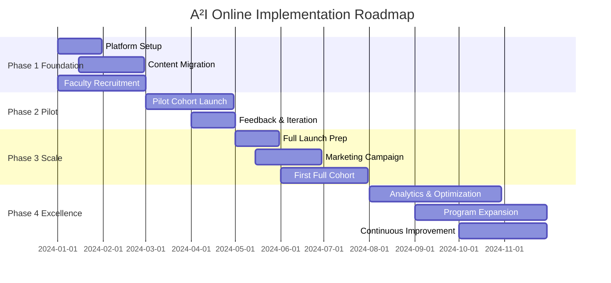

# Implementation Roadmap for Online Delivery

## Executive Summary

This roadmap outlines the phased approach to transform the A²I curriculum for fully online, global delivery. The implementation spans 12 months, divided into four phases with clear milestones, success metrics, and risk mitigation strategies.

## Timeline Overview



## Phase 1: Foundation (Months 1-3)

### Objectives
- Establish technical infrastructure
- Adapt content for online delivery
- Build initial team

### Month 1: Infrastructure Setup

```yaml
week_1_2:
  technical_setup:
    - Canvas LMS instance configuration
    - Coursera specialization creation
    - GitHub organization setup
    - Google Cloud project structure
    - SSO implementation
  
  team_formation:
    - Program Director hiring
    - Lead Instructor recruitment begins
    - Technical team onboarding
    - Vendor negotiations

week_3_4:
  platform_integration:
    - API connections established
    - Data synchronization tested
    - Unified dashboard prototype
    - Mobile app configuration
  
  content_planning:
    - Content audit complete
    - Video production schedule
    - Assessment redesign begins
    - Resource library structure
```

### Month 2: Content Development

```javascript
const contentDevelopment = {
    week_5_6: {
        videoProduction: {
            lectures: '20 hours raw footage',
            editing: 'Professional post-production',
            formatting: '5-7 minute segments',
            accessibility: 'Captions and transcripts'
        },
        
        assessmentCreation: {
            businessCases: 10,
            projectTemplates: 8,
            peerReviewRubrics: 15,
            autoGradedQuizzes: 40
        }
    },
    
    week_7_8: {
        platformUpload: {
            coursera: 'Week 1-4 content live',
            canvas: 'Course shells populated',
            github: 'Starter repos created',
            testing: 'Student journey walkthrough'
        },
        
        qualityAssurance: {
            contentReview: 'Subject matter experts',
            accessibilityAudit: 'WCAG 2.1 compliance',
            mobileOptimization: 'Cross-device testing',
            linkVerification: 'All resources accessible'
        }
    }
};
```

### Month 3: Team Building

```python
# recruitment_tracking.py
recruitment_targets = {
    'lead_instructors': {
        'needed': 8,
        'hired': 0,
        'in_process': 0,
        'sources': ['Academic networks', 'Industry', 'Alumni']
    },
    'regional_facilitators': {
        'needed': 12,
        'regions': ['Americas', 'EMEA', 'APAC'],
        'languages': ['English', 'Spanish', 'Mandarin', 'French']
    },
    'industry_mentors': {
        'needed': 20,
        'sectors': ['Tech', 'Finance', 'Healthcare', 'Retail'],
        'commitment': '2-5 hours/week'
    },
    'peer_coaches': {
        'needed': 0,  # Will come from pilot graduates
        'training': 'Developed for future cohorts'
    }
}
```

### Phase 1 Success Criteria

| Metric | Target | Status |
|--------|--------|--------|
| Platform Readiness | 100% core features | ⬜ |
| Content Migration | 50% complete | ⬜ |
| Faculty Recruitment | 60% hired | ⬜ |
| Budget Utilization | Within 10% of plan | ⬜ |
| Timeline Adherence | No critical delays | ⬜ |

## Phase 2: Pilot Program (Months 4-5)

### Pilot Cohort Design

```yaml
pilot_specifications:
  cohort_size: 25-30 students
  duration: 8 weeks
  courses: First 2 core courses
  
  student_selection:
    criteria:
      - Geographic diversity (minimum 5 time zones)
      - Professional backgrounds varied
      - Technical skill range
      - Commitment to feedback
    
    incentives:
      - 50% tuition discount
      - Direct access to leadership
      - Co-creation opportunity
      - Alumni ambassador role
  
  success_metrics:
    completion_rate: ">70%"
    satisfaction_score: ">3.8/5"
    technical_issues: "<5 critical"
    engagement_rate: ">60% daily active"
```

### Month 4: Pilot Launch

```javascript
// Pilot Week-by-Week Plan
const pilotSchedule = {
    week_0: {
        activities: [
            'Orientation and onboarding',
            'Technical setup verification',
            'Pod formation',
            'Cohort identity creation'
        ],
        monitoring: ['Login success', 'Platform navigation', 'First posts']
    },
    
    weeks_1_4: {
        dailyRhythm: {
            content: 'New modules Monday/Wednesday',
            support: 'Office hours Tuesday/Thursday',
            assessment: 'Submissions Friday',
            social: 'Weekend optional activities'
        },
        
        dataCollection: {
            quantitative: ['Time on platform', 'Completion rates', 'Scores'],
            qualitative: ['Weekly surveys', 'Focus groups', 'Instructor notes']
        }
    },
    
    weeks_5_8: {
        adjustments: 'Real-time based on feedback',
        intensiveSupport: 'Additional facilitator hours',
        documentation: 'Detailed issue tracking',
        celebration: 'Graduation ceremony'
    }
};
```

### Month 5: Iteration and Refinement

```python
class PilotAnalysis:
    def __init__(self, cohort_data):
        self.data = cohort_data
        
    def identify_improvements(self):
        return {
            'content_gaps': self.analyze_confusion_points(),
            'platform_issues': self.categorize_technical_problems(),
            'engagement_drops': self.find_disengagement_triggers(),
            'support_needs': self.assess_facilitator_load()
        }
    
    def prioritize_fixes(self, improvements):
        priorities = {
            'critical': [],  # Must fix before scale
            'important': [], # Should fix soon
            'nice_to_have': []  # Can wait
        }
        
        for issue in improvements:
            if issue.affects_completion():
                priorities['critical'].append(issue)
            elif issue.affects_satisfaction():
                priorities['important'].append(issue)
            else:
                priorities['nice_to_have'].append(issue)
                
        return priorities
    
    def implement_changes(self, priorities):
        timeline = {
            'week_1': priorities['critical'],
            'week_2_3': priorities['important'],
            'week_4': 'Testing and validation',
            'documentation': 'Update all materials'
        }
        return timeline
```

### Phase 2 Deliverables

- ✅ Pilot cohort successfully completed
- ✅ Comprehensive feedback report
- ✅ Platform optimization list
- ✅ Content improvement plan
- ✅ Scaling readiness assessment

## Phase 3: Scale (Months 6-8)

### Pre-Launch Preparation

```yaml
month_6_preparation:
  marketing_campaign:
    channels:
      - LinkedIn targeted ads
      - University partnerships
      - Corporate L&D outreach
      - Alumni referrals
      - Industry publications
    
    messaging:
      - "AI Leadership for Business"
      - "100% Online, 100% Applied"
      - "Global Cohort, Local Impact"
    
    goals:
      applications: 500
      enrollments: 150
      geographic_diversity: "30+ countries"
  
  operational_readiness:
    faculty:
      - All positions filled
      - Training completed
      - Shadow teaching done
    
    platforms:
      - Stress tested for 200 users
      - Backup systems in place
      - Support documentation complete
    
    processes:
      - Enrollment automated
      - Payment processing tested
      - Communication templates ready
```

### Month 7-8: First Full Cohort

```javascript
class CohortManagement {
    constructor() {
        this.cohortSize = 150;
        this.pods = 30;  // 5 students each
        this.sections = 3;  // 50 students per instructor
    }
    
    launchSequence() {
        const timeline = {
            't_minus_14': 'Final enrollment confirmation',
            't_minus_7': 'Welcome packages sent',
            't_minus_3': 'Platform access granted',
            't_minus_1': 'Orientation sessions',
            't_0': 'Course officially begins',
            
            week1_2: {
                focus: 'Community building',
                support: 'Heavy facilitation',
                monitoring: 'Daily analytics review'
            },
            
            week3_4: {
                focus: 'Learning momentum',
                support: 'Normal facilitation',
                monitoring: 'Weekly reviews'
            },
            
            week5_6: {
                focus: 'Project work',
                support: 'Mentorship emphasis',
                monitoring: 'Progress tracking'
            },
            
            week7_8: {
                focus: 'Completion push',
                support: 'Individual interventions',
                monitoring: 'Success celebration'
            }
        };
        
        return timeline;
    }
    
    successMetrics() {
        return {
            completion: '>80%',
            satisfaction: '>4.2/5',
            nps: '>50',
            employment: '>30% improved outcomes'
        };
    }
}
```

### Scaling Operations

```python
def scale_operations(from_pilot, to_full):
    scaling_factors = {
        'students': from_pilot * 5,  # 30 to 150
        'facilitators': from_pilot * 3,  # 2 to 6
        'support_tickets': from_pilot * 4,  # Non-linear
        'server_capacity': from_pilot * 6,  # Buffer included
        'content_updates': from_pilot * 1.5  # Some economies
    }
    
    operational_changes = {
        'automation': [
            'Grading workflows',
            'Enrollment processing',
            'Certificate generation',
            'Reminder notifications'
        ],
        'delegation': [
            'Peer grading increases',
            'AI handles basic questions',
            'Student moderators',
            'Tiered support model'
        ],
        'optimization': [
            'Batch similar requests',
            'FAQ automation',
            'Predictive interventions',
            'Resource caching'
        ]
    }
    
    return implement_changes(scaling_factors, operational_changes)
```

## Phase 4: Excellence (Months 9-12)

### Continuous Improvement Framework

```yaml
month_9_10_optimization:
  data_driven_improvements:
    analytics_platform:
      - Learning analytics dashboard
      - Predictive models deployed
      - A/B testing framework
      - ROI measurement tools
    
    optimization_areas:
      content:
        - Module completion times
        - Confusion points identified
        - Engagement heat maps
        - Assessment effectiveness
      
      platform:
        - Load time optimization
        - Mobile experience enhancement
        - API response times
        - Error rate reduction
      
      support:
        - Response time improvement
        - FAQ effectiveness
        - Facilitator workload balance
        - Mentor utilization
```

### Month 11-12: Program Expansion

```javascript
const expansionStrategy = {
    newPrograms: {
        executiveTrack: {
            duration: '4 weeks intensive',
            target: 'C-suite and senior managers',
            price: 'Premium positioning',
            launch: 'Month 11'
        },
        
        certificateProgram: {
            duration: 'Self-paced, 6 months max',
            target: 'Career switchers',
            price: 'Accessible',
            launch: 'Month 12'
        },
        
        corporatePartnership: {
            format: 'Cohort-based for companies',
            customization: '20% company-specific',
            size: '20-50 employees',
            launch: 'Month 12'
        }
    },
    
    geographicExpansion: {
        priorityMarkets: ['India', 'Brazil', 'Nigeria', 'Indonesia'],
        localization: ['Content examples', 'Time zones', 'Payment methods'],
        partnerships: ['Local universities', 'Government programs']
    },
    
    academicIntegration: {
        creditPathway: 'Articulation agreements',
        stackableCredentials: 'Micro-masters alignment',
        doctoralPathway: 'Research track addition'
    }
};
```

### Excellence Metrics

```python
class ExcellenceMetrics:
    def __init__(self):
        self.targets = {
            'academic': {
                'completion_rate': 85,
                'learning_gains': 80,  # Pre/post assessment
                'satisfaction': 4.5,
                'recommendation': 90  # % would recommend
            },
            'operational': {
                'cost_per_student': -20,  # % reduction
                'faculty_satisfaction': 4.3,
                'automation_rate': 60,  # % of routine tasks
                'response_time': 4  # hours average
            },
            'business': {
                'enrollment_growth': 50,  # % YoY
                'revenue_target': 120,  # % of projection
                'profit_margin': 35,
                'roi_for_students': 200  # % within 1 year
            },
            'impact': {
                'job_placement': 85,
                'salary_increase': 30,
                'diversity_index': 0.7,
                'global_reach': 50  # countries
            }
        }
    
    def dashboard(self):
        return self.visualize_progress(self.targets)
```

## Risk Management

### Risk Matrix and Mitigation

```python
risk_management = {
    'high_probability_high_impact': {
        'faculty_shortage': {
            'mitigation': 'Build 20% buffer, develop internal pipeline',
            'monitoring': 'Weekly recruitment tracking',
            'escalation': 'Reduce cohort size if needed'
        },
        'platform_failure': {
            'mitigation': 'Multi-platform redundancy, local backups',
            'monitoring': '24/7 uptime monitoring',
            'escalation': 'Immediate failover procedures'
        }
    },
    
    'low_probability_high_impact': {
        'data_breach': {
            'mitigation': 'Security audits, encryption, training',
            'monitoring': 'Continuous security scanning',
            'escalation': 'Incident response team'
        },
        'regulatory_change': {
            'mitigation': 'Legal counsel, compliance buffer',
            'monitoring': 'Regulatory tracking',
            'escalation': 'Rapid curriculum adjustment'
        }
    },
    
    'high_probability_low_impact': {
        'student_complaints': {
            'mitigation': 'Robust support system, clear expectations',
            'monitoring': 'Sentiment analysis',
            'escalation': 'Service recovery protocols'
        },
        'content_errors': {
            'mitigation': 'Peer review, version control',
            'monitoring': 'Error reporting system',
            'escalation': 'Rapid fix and communicate'
        }
    }
}
```

## Budget Overview

### 12-Month Implementation Budget

```yaml
budget_breakdown:
  personnel:  # 45% of budget
    program_director: $150,000
    lead_instructors: $200,000  # 8 × $25K
    facilitators: $120,000  # 12 × $10K
    technical_team: $200,000
    support_staff: $80,000
    subtotal: $750,000
  
  technology:  # 25% of budget
    platform_licenses: $150,000
    development_costs: $100,000
    infrastructure: $80,000
    tools_and_software: $40,000
    security_and_backup: $30,000
    subtotal: $400,000
  
  content:  # 15% of budget
    video_production: $80,000
    assessment_development: $40,000
    resource_licensing: $30,000
    localization: $20,000
    updates_maintenance: $30,000
    subtotal: $200,000
  
  marketing:  # 10% of budget
    digital_campaigns: $60,000
    partnerships: $30,000
    events_webinars: $20,000
    materials: $15,000
    analytics_tools: $15,000
    subtotal: $140,000
  
  operations:  # 5% of budget
    training: $30,000
    quality_assurance: $25,000
    legal_compliance: $20,000
    contingency: $25,000
    subtotal: $100,000
  
  total: $1,590,000
  
  revenue_projections:
    pilot: $37,500  # 25 × $1,500
    cohort_1: $450,000  # 150 × $3,000
    cohort_2: $600,000  # 200 × $3,000
    cohort_3: $750,000  # 250 × $3,000
    year_1_total: $1,837,500
    year_1_profit: $247,500
```

## Success Factors

### Critical Success Factors

1. **Leadership Commitment**
   - Executive sponsorship
   - Resource allocation
   - Change management support

2. **Faculty Excellence**
   - Quality recruitment
   - Continuous training
   - Performance incentives

3. **Student Experience**
   - Seamless technology
   - Engaging content
   - Strong support

4. **Operational Excellence**
   - Efficient processes
   - Data-driven decisions
   - Continuous improvement

5. **Market Fit**
   - Clear value proposition
   - Competitive pricing
   - Strong outcomes

## Communication Plan

### Stakeholder Communication

```markdown
## Communication Schedule

### Weekly
- Student newsletter
- Faculty sync meeting
- Analytics review

### Monthly
- Advisory board update
- Investor/sponsor report
- Public blog post

### Quarterly
- Comprehensive review
- Strategy adjustment
- Impact report

### Annually
- Program evaluation
- Strategic planning
- Accreditation review
```

## Conclusion

This implementation roadmap provides a structured path to launching and scaling the online A²I program. Success requires careful coordination across multiple workstreams, continuous monitoring and adjustment, and unwavering focus on student outcomes. With proper execution, the program can achieve excellence in online delivery while maintaining the innovative vision of the A²I curriculum.

## Next Steps

1. **Immediate** (Week 1)
   - Form implementation team
   - Secure budget approval
   - Begin platform setup

2. **Short-term** (Month 1)
   - Complete infrastructure
   - Start content development
   - Launch recruitment

3. **Medium-term** (Months 2-3)
   - Finalize pilot cohort
   - Complete team hiring
   - Test all systems

4. **Long-term** (Months 4-12)
   - Execute pilot
   - Scale operations
   - Achieve excellence